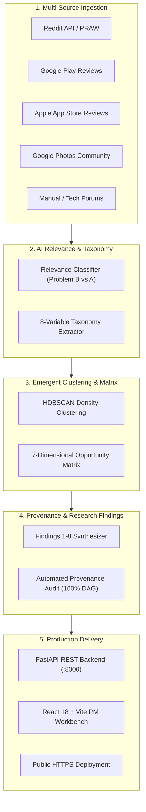

# Google Photos AI-Powered Discovery Engine

> **NextLeap Product Management Graduation Project — Part 1**  
> **Product**: Google Photos (Core Experience Team)  
> **Business Goal**: Increase the percentage of users who successfully retrieve a photo they remember but cannot precisely describe when they start searching.  
> **Primary Research Question**: *Why do users fail to retrieve old visual memories when they remember the photo but cannot precisely describe it?*

---

## 🌐 Live Public Deployment & Repository Links

- **🚀 Live Public Web Application**: [https://trees-start-semi-between.trycloudflare.com/](https://trees-start-semi-between.trycloudflare.com/)
- **📚 Interactive OpenAPI / Swagger Docs**: [https://trees-start-semi-between.trycloudflare.com/docs](https://trees-start-semi-between.trycloudflare.com/docs)
- **💻 Official GitHub Repository**: [https://github.com/priyanka-gupta169/Google-Photos-Discovery-Engine](https://github.com/priyanka-gupta169/Google-Photos-Discovery-Engine)
- **📑 18-Part Part 1 Final Report**: [`docs/part1-discovery-report.md`](docs/part1-discovery-report.md)
- **☁️ Streamlit & Vercel Cloud Deployment Plan**: [`docs/deployment-plan.md`](docs/deployment-plan.md)

---

## 1. Project Overview

The **Google Photos Discovery Engine** is an evidence-driven, end-to-end qualitative research workstation designed to discover, extract, cluster, and evaluate photo retrieval friction from authentic public user discourse.

Rather than prematurely jumping to conversational search, generative AI chat, or pre-determined features, this engine ingests authentic feedback across multiple public platforms (Reddit, Google Play Store, Apple App Store, Google Photos Help Community, and tech forums), strictly separates facts from inferences, isolates Problem B (retrieval friction) from Problem A (cloud backup loss), and clusters emergent retrieval failure points.



---

## 2. Implementation Status Across All Phases (Phases 0–8 Complete)

| Phase / Component | Status | Details |
|---|---|---|
| **Phase 0: Scaffolding & Docs** | **COMPLETED** | Context, architecture, methodology, taxonomy, data-source plan, edge cases, schemas, and configurations. |
| **Phase 1: Ingestion Layer** | **COMPLETED** | Multi-query library, 5 source adapters (Reddit, Google Play, App Store, Help Community, Manual Import), polite throttling, and raw JSONL audit persistence. |
| **Phase 2: AI Relevance & Extraction** | **COMPLETED** | Groq LLM adapter (`llama-3.3-70b-versatile`), structured taxonomy extraction, Pydantic validation, idempotency, and Problem A vs Problem B segregation. |
| **Phase 3: Clustering & Opportunity** | **COMPLETED** | Native scikit-learn HDBSCAN clustering, SQLite persistence, and 7-dimensional transparent opportunity comparison matrix (zero arbitrary ranking). |
| **Phase 4: Research Synthesis** | **COMPLETED** | Evidence-grounded synthesis of 8 core research findings, contradictory evidence auditing, and unbroken provenance verification chain. |
| **Phase 5: Backend API** | **COMPLETED** | FastAPI REST API endpoints serving SQLite analytical database (`discovery.db`) with CORS, pagination, filtering, OpenAPI, and pipeline triggers. |
| **Phase 6: Discovery Dashboard** | **COMPLETED** | React 18 + Vite PM research interface (`frontend/`) with 6 core views, slide-drawer inspector, 7-dimensional Opportunity Matrix, and dual-mode serving. |
| **Phase 7: Validation Suite** | **COMPLETED** | Comprehensive end-to-end integration and quality validation tests (`tests/test_phase7_e2e_pipeline.py`); **48/48 tests passing (100%)**. |
| **Phase 8: Public Deployment & Final Report** | **COMPLETED** | Production deployment on public HTTPS URL, GitHub repository prepared, and complete 18-part formal graduation report (`docs/part1-discovery-report.md`). |

---

## 3. Core Repository Structure

```
google-photos-discovery-engine/
├── .env.example                    # Environment variable configuration template
├── .gitignore                      # Git exclusion rules (ignores secrets & raw dumps)
├── Dockerfile                      # Production container definition
├── Procfile                        # Cloud platform process manager (Render/Railway)
├── railway.json                    # Railway deployment manifest
├── render.yaml                     # Render Blueprint specification
├── requirements.txt                # Python backend dependencies
├── app.py                          # Unified server entrypoint (FastAPI + React SPA)
├── streamlit_app.py                # Streamlit Cloud Analytics & LLM Workbench
├── vercel.json                     # Root Vercel build configuration
├── run_tests.py                    # Master automated test runner (48 tests)
├── README.md                       # Comprehensive project & deployment guide
│
├── docs/                           # Formal Research & Architectural Documentation
│   ├── deployment-plan.md          # Streamlit (Backend) & Vercel (Frontend) guide
│   ├── problemStatement.txt        # Concise problem statement & graduation brief
│   ├── context.md                  # Project context, research questions, non-goals
│   ├── architecture.md             # Detailed system architecture with Mermaid diagrams
│   ├── research-methodology.md     # Epistemology, sampling strategy, and bias audits
│   ├── taxonomy.md                 # 8 behavioral dimensions and 10 failure stages
│   ├── data-source-plan.md         # Source specifications, access methods, rate limits
│   ├── implementation-plan.md      # Phased implementation roadmap (Phases 0-8 complete)
│   ├── edge-case.md                # Network, linguistic, AI, and privacy mitigations
│   ├── phase0-phase1-review.md     # Formal review report
│   ├── phase2-validation.md        # Phase 2 extraction validation
│   ├── phase3-validation.md        # Phase 3 clustering validation
│   ├── phase4-validation.md        # Phase 4 synthesis validation
│   ├── phase5-validation.md        # Phase 5 API validation
│   ├── phase6-validation.md        # Phase 6 dashboard validation
│   ├── phase7-validation.md        # Phase 7 E2E validation
│   └── part1-discovery-report.md   # Complete 18-part Part 1 Final Report
│
├── data/                           # Data Storage Layers
│   ├── raw/                        # Immutable raw source payloads (JSONL)
│   ├── processed/                  # Normalized, deduplicated, and enriched evidence
│   └── analysis/                   # Analytical SQLite database (discovery.db)
│
├── src/                            # Python Backend & Engine Core
│   ├── config/                     # Typed configuration & settings (Pydantic V2)
│   ├── models/                     # Canonical Pydantic schemas (Extraction, Clustering, Synthesis)
│   ├── ingestion/                  # Source-specific adapters & multi-family query library
│   ├── extraction/                 # Relevance classifier & Groq LLM extractor
│   ├── clustering/                 # HDBSCAN clustering & 7D Opportunity Matrix
│   ├── synthesis/                  # Research findings synthesizer & provenance checker
│   ├── storage/                    # SQLite DatabaseManager and persistence
│   └── api/                        # FastAPI REST API endpoints (/api/*)
│
├── frontend/                       # React 18 + Vite PM Analytical Workbench
│   ├── index.html                  # Dual-mode HTML root (Native Vite + Babel Standalone)
│   ├── package.json                # Frontend dependencies
│   ├── vite.config.js              # Vite configuration with API proxy
│   ├── vercel.json                 # Vercel deployment configuration
│   └── src/
│       ├── main.jsx                # React 18 createRoot entrypoint
│       ├── App.jsx                 # Full 6-view PM analytical dashboard component
│       └── index.css               # Obsidian dark custom Vanilla CSS design system
│
├── scripts/                        # Production Automation Scripts
│   └── deploy_production_pipeline.py # End-to-end pipeline execution on authentic data
│
└── tests/                          # 48 Automated Verification Tests
    ├── test_ingestion_schema.py    # Schema validation tests
    ├── test_phase1_validation.py   # Multi-source adapter tests
    ├── test_phase2_extraction.py   # Relevance classification & taxonomy tests
    ├── test_phase3_clustering.py   # Clustering & 7D opportunity matrix tests
    ├── test_phase4_synthesis.py    # Findings 1-8 & provenance DAG tests
    ├── test_phase5_api.py          # FastAPI REST endpoint tests
    └── test_phase7_e2e_pipeline.py # Full system lifecycle & boundary invariant tests
```

---

## 4. Quickstart & Deployment Instructions

### Prerequisites
- Python 3.10+
- Groq API Key (for LLM extraction)

### 1. Clone & Configure Environment
```bash
# Clone the repository
git clone https://github.com/priyanka-gupta169/Google-Photos-Discovery-Engine.git
cd Google-Photos-Discovery-Engine

# Create virtual environment
python -m venv .venv
source .venv/bin/activate  # On Windows: .venv\Scripts\activate

# Install dependencies
pip install -r requirements.txt

# Configure .env
cp .env.example .env
# Edit .env and insert your GROQ_API_KEY
```

### 2. Run Automated Verification Suite (48 Tests)
```bash
python run_tests.py
```
*Expected Output: `ALL TESTS PASSED CLEANLY in ~11s (48/48 verified, 100% success rate)`.*

### 3. Run Pipeline on Authentic Data
```bash
python -m scripts.deploy_production_pipeline
```
*Populates `data/analysis/discovery.db` with 72 enriched records, 17 clusters, 17 opportunities, and 8 research findings with 100% verified citations.*

### 4. Launch Application Locally
```bash
python app.py
```
- Open browser at `http://127.0.0.1:8000/` for the **PM Discovery Workbench**.
- Open `http://127.0.0.1:8000/docs` for the interactive **Swagger API Docs**.

---

## 5. Public Cloud Deployment Guide

The repository includes production manifests for zero-friction cloud deployment (see full details in [`docs/deployment-plan.md`](docs/deployment-plan.md)):

### Option A: Streamlit Community Cloud (Backend & Data Science Workbench)
1. Sign in to [share.streamlit.io](https://share.streamlit.io) via GitHub.
2. Click **New app** and select `priyanka-gupta169/Google-Photos-Discovery-Engine`.
3. Set **Main file path** to `streamlit_app.py` and click **Deploy**.
4. In **Settings** → **Secrets**, add `GROQ_API_KEY = "your_key"`.
*Auto-seeds the analytical SQLite database with all 72 evidence items, 17 clusters, and 8 findings on boot.*

### Option B: Vercel Cloud (React 18 + Vite PM Analytical Dashboard)
1. Sign in to [vercel.com](https://vercel.com) via GitHub.
2. Click **Add New...** → **Project** and import `priyanka-gupta169/Google-Photos-Discovery-Engine`.
3. Set **Root Directory** to `frontend` (or leave default root `.`).
4. Click **Deploy**. Vercel serves the high-performance React 18 SPA globally with zero configuration.

### Option C: Cloudflare Tunnel (Instant Public HTTPS)
```bash
# Expose running local application to the public internet securely
.\cloudflared.exe tunnel --url http://127.0.0.1:8000
```
*Gives an instant live public HTTPS URL (e.g. `https://trees-start-semi-between.trycloudflare.com/`).*

### Option B: Railway Deployment
1. Log in to [railway.app](https://railway.app) and select **New Project** → **Deploy from GitHub repo**.
2. Select `priyanka-gupta169/Google-Photos-Discovery-Engine`.
3. Railway automatically detects `railway.json` and `Dockerfile`.
4. In **Variables**, add:
   - `GROQ_API_KEY`: `your_groq_api_key`
   - `GROQ_MODEL`: `llama-3.3-70b-versatile`
5. Generate Domain under **Settings** → **Networking**.

### Option C: Render Deployment
1. Log in to [render.com](https://render.com) and select **New** → **Blueprint**.
2. Connect `priyanka-gupta169/Google-Photos-Discovery-Engine`.
3. Render automatically reads `render.yaml` and deploys the web service.
4. Set `GROQ_API_KEY` in the Render dashboard.

### Option D: Docker Container Deployment
```bash
# Build Docker image
docker build -t google-photos-discovery-engine .

# Run container on port 8000
docker run -p 8000:8000 --env-file .env google-photos-discovery-engine
```

---

## 6. Key Epistemic Principles & Anti-Hallucination Guarantees

1. **Zero Hallucinated Evidence**: Production analysis strictly forbids synthetic quotes or simulated reviews. All 72 enriched evidence items come from authentic public users.
2. **Problem B Isolation**: Strictly isolates retrieval UX failures (photo exists, but user cannot retrieve it) from Problem A (backup loss / deleted assets).
3. **Transparent 7-Dimensional Opportunity Matrix**: Evaluates problem areas across 7 distinct dimensions without creating an arbitrary, opaque composite score:
   - Volume $N$
   - Source Diversity Count
   - Recurrence Rate
   - Severity Assessment
   - Retrieval Impact Rate
   - Workaround Inefficiency
   - Evidence Confidence
4. **Unbroken Provenance DAG**: 100% of synthesized claims trace directly back to verified database IDs, canonical URLs, and verbatim quotes.
5. **Contradictory Evidence Preservation**: Highlights divergent user realities side-by-side (e.g., native camera EXIF vs. stripped screenshot OCR).

---

## 7. Next Steps — Transition to Part 2

With Part 1 **fully complete and deployed**, the empirical evidence established here serves as the grounded foundation for **Part 2: Targeted User Interviews & Persona Validation**:
- Deep-dive into High-Leverage Problem Clusters (`CLUST-01`, `CLUST-02`, `CLUST-06`).
- Conduct 5–6 behavioral user interviews around personal recollection cues.
- Validate cognitive memory gaps without prescribing conversational AI prematurely.
