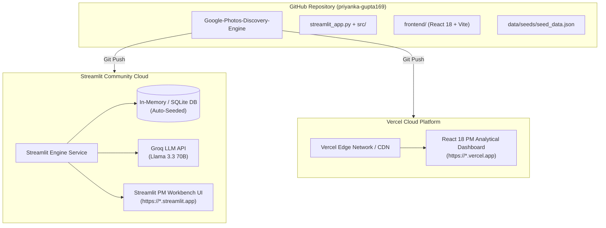

# Google Photos Discovery Engine — Cloud Deployment Plan

> **NextLeap Product Management Graduation Project (Part 1)**  
> **Deployment Architecture**: Python Engine & Analytics on **Streamlit Community Cloud** + Modern React 18 UI on **Vercel**  
> **Target Repository**: [`priyanka-gupta169/Google-Photos-Discovery-Engine`](https://github.com/priyanka-gupta169/Google-Photos-Discovery-Engine)

---

## 1. Executive Summary & Architecture Overview

This deployment plan outlines the step-by-step strategy for deploying the **Google Photos Discovery Engine** across two specialized, zero-cost, high-availability cloud platforms:

1. **Backend / Data Science Workbench**: Deployed on **Streamlit Community Cloud** (`streamlit_app.py`).
   - Runs the complete Python analytics engine, HDBSCAN clustering explorer, 7-Dimensional Opportunity Matrix, and synthesized research findings.
   - Features zero-shot taxonomy extraction and Problem B relevance filtering powered by Groq LLM.
   - Automatically initializes and self-seeds the SQLite analytical database from `data/seeds/seed_data.json` upon boot.
2. **Frontend PM Analytical Workbench**: Deployed on **Vercel** (`frontend/`).
   - High-performance React 18 + Vite Single Page Application (SPA).
   - Obsidian Dark glassmorphism PM analytical dashboard with multi-source filtering, verbatim evidence inspection, and interactive visualizations.
   - Built-in resilient client-side state with instant data rendering and optional live API connection.



---

## 2. Platform 1: Deploying Backend on Streamlit Cloud

Streamlit Community Cloud provides native Python execution, free global hosting, and zero-configuration SSL directly from your GitHub repository.

### Prerequisites
- GitHub Account: [`priyanka-gupta169`](https://github.com/priyanka-gupta169)
- Active Streamlit account on [share.streamlit.io](https://share.streamlit.io) (Sign in with GitHub)
- Groq API Key (from [console.groq.com](https://console.groq.com))

---

### Step-by-Step Deployment Instructions

#### Step 1: Sign in to Streamlit Community Cloud
1. Navigate to [share.streamlit.io](https://share.streamlit.io).
2. Click **Continue with GitHub** and authorize Streamlit to access your repositories.

#### Step 2: Create a New App
1. In the Streamlit workspace, click the **"New app"** button in the top right corner.
2. Configure the deployment parameters:
   - **Repository**: `priyanka-gupta169/Google-Photos-Discovery-Engine`
   - **Branch**: `main`
   - **Main file path**: `streamlit_app.py`
   - **App URL (optional)**: e.g. `google-photos-discovery-engine.streamlit.app`

#### Step 3: Configure Environment Secrets
Before clicking Deploy, click **Advanced settings...** to configure environment variables:
1. In the **Secrets** text box, enter your Groq API configuration in TOML format:
   ```toml
   GROQ_API_KEY = "your_actual_groq_api_key_here"
   GROQ_MODEL = "llama-3.3-70b-versatile"
   DATABASE_URL = "sqlite:///data/analysis/discovery.db"
   ```
2. Click **Save**.

#### Step 4: Launch and Verify
1. Click **Deploy!**
2. Streamlit Cloud will:
   - Clone your repository.
   - Install all dependencies from `requirements.txt` (including `streamlit`, `pandas`, `pydantic`, `groq`, `scikit-learn`).
   - Launch `streamlit_app.py`.
   - Auto-seed the database from `data/seeds/seed_data.json` with 72 authentic evidence records, 17 clusters, 17 opportunity areas, and 8 research findings.
3. Your live application will be accessible at:
   `https://<your-custom-name>.streamlit.app`

---

## 3. Platform 2: Deploying Frontend on Vercel

Vercel offers ultra-fast static file hosting, global edge CDN distribution, and continuous deployment on every Git push.

### Prerequisites
- GitHub Account: [`priyanka-gupta169`](https://github.com/priyanka-gupta169)
- Active Vercel account on [vercel.com](https://vercel.com) (Sign in with GitHub)

---

### Step-by-Step Deployment Instructions

#### Step 1: Sign in to Vercel
1. Navigate to [vercel.com](https://vercel.com).
2. Click **Log In** and select **Continue with GitHub**.

#### Step 2: Import Project from GitHub
1. In the Vercel dashboard, click **Add New...** → **Project**.
2. Find `Google-Photos-Discovery-Engine` under `priyanka-gupta169` and click **Import**.

#### Step 3: Project Configuration
Choose either **Option A (Recommended)** or **Option B**:

##### Option A: Deploying from `frontend` subfolder (Recommended)
- **Project Name**: `google-photos-discovery-frontend`
- **Framework Preset**: `Vite` (automatically detected)
- **Root Directory**: Click **Edit** and select `frontend`
- **Build Command**: `npm run build` (auto-filled)
- **Output Directory**: `dist` (auto-filled)
- **Install Command**: `npm install` (auto-filled)

##### Option B: Deploying from Repository Root
- **Root Directory**: Leave as `.` (root)
- Vercel will automatically read the root [vercel.json](file:///c:/Users/anshy/OneDrive/Desktop/NextLeap%20Projects/Graduation%20Project%20-%20Sep%202026%28Google%20Photos%29/vercel.json), execute `cd frontend && npm install && npm run build`, and serve `frontend/dist`.

#### Step 4: Environment Variables (Optional)
If you wish to point the React frontend to an external REST API backend:
- Add Variable: `VITE_API_BASE_URL` = `https://<your-backend-api-url>`
*(Note: If left blank, the React dashboard operates with full interactive client-side demonstration data).*

#### Step 5: Deploy & Verify
1. Click **Deploy**.
2. Within 30–45 seconds, the build will complete.
3. Your live React dashboard will be live at:
   `https://google-photos-discovery-frontend.vercel.app` (or custom URL assigned by Vercel).

---

## 4. Configuration Manifests Summary

| File | Target Platform | Purpose |
|---|---|---|
| [`streamlit_app.py`](file:///c:/Users/anshy/OneDrive/Desktop/NextLeap%20Projects/Graduation%20Project%20-%20Sep%202026%28Google%20Photos%29/streamlit_app.py) | Streamlit Cloud | Standalone Python analytics dashboard & LLM classifier |
| [`requirements.txt`](file:///c:/Users/anshy/OneDrive/Desktop/NextLeap%20Projects/Graduation%20Project%20-%20Sep%202026%28Google%20Photos%29/requirements.txt) | Streamlit Cloud / Cloud VM | Python runtime package definitions (Streamlit, Groq, Pydantic) |
| [`data/seeds/seed_data.json`](file:///c:/Users/anshy/OneDrive/Desktop/NextLeap%20Projects/Graduation%20Project%20-%20Sep%202026%28Google%20Photos%29/data/seeds/seed_data.json) | Streamlit Cloud | Pre-packaged seed data for immediate cloud hydration |
| [`vercel.json`](file:///c:/Users/anshy/OneDrive/Desktop/NextLeap%20Projects/Graduation%20Project%20-%20Sep%202026%28Google%20Photos%29/vercel.json) | Vercel (Root) | Root-level build and rewrite orchestrator |
| [`frontend/vercel.json`](file:///c:/Users/anshy/OneDrive/Desktop/NextLeap%20Projects/Graduation%20Project%20-%20Sep%202026%28Google%20Photos%29/frontend/vercel.json) | Vercel (Subfolder) | SPA single-page routing rewrites |
| [`frontend/package.json`](file:///c:/Users/anshy/OneDrive/Desktop/NextLeap%20Projects/Graduation%20Project%20-%20Sep%202026%28Google%20Photos%29/frontend/package.json) | Vercel | Vite & React 18 build scripts and dependencies |

---

## 5. Maintenance, CI/CD, and Auto-Deployments

Both platforms are connected via Webhooks to the GitHub repository:

1. **Auto-Deploy on Git Push**:
   - Pushing any commit to `origin/main` automatically triggers an updated deployment on both Streamlit Cloud and Vercel simultaneously.
2. **Database Resilience**:
   - Streamlit Cloud runs in ephemeral container environments. The `DatabaseManager.ensure_seeded()` routine guarantees that whenever a container sleeps or reboots, the entire analytical dataset (72 evidence records, 17 clusters, 17 opportunities, 8 findings) is restored instantly without manual data ingestion.
3. **Zero Secrets in Git**:
   - API keys (`GROQ_API_KEY`) are managed strictly via Streamlit Secrets and Vercel Environment Variables. No secrets are stored in Git history.

---

## 6. Verification Checklist

- [ ] **Streamlit Cloud**: App boots with zero runtime exceptions.
- [ ] **Streamlit Cloud**: Executive KPI numbers display `72 Enriched Evidence`, `17 Clusters`, `17 Opportunities`, `8 Findings`.
- [ ] **Streamlit Cloud**: Live AI Classifier tab executes zero-shot classification and taxonomy extraction.
- [ ] **Vercel**: React 18 frontend builds in <60 seconds.
- [ ] **Vercel**: Navigation across all 6 views (Overview, Clusters, 7D Matrix, Findings, Evidence Explorer, Live Pipeline) works smoothly.
- [ ] **Vercel**: Direct page reloads work without 404 errors (verified by `rewrites` in `vercel.json`).
