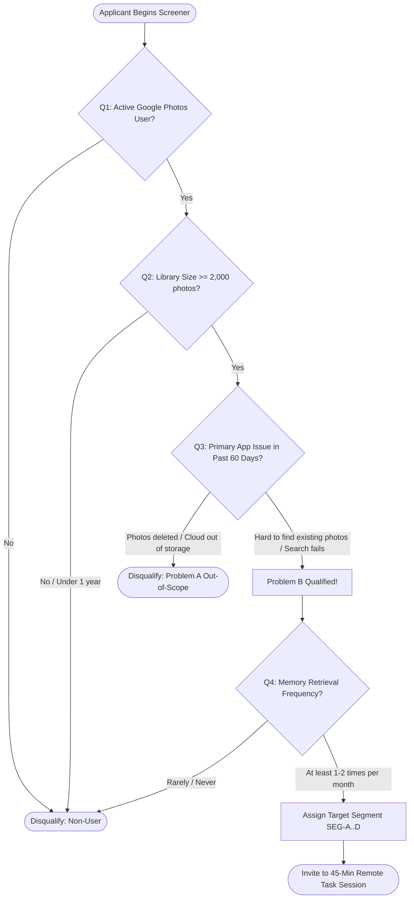
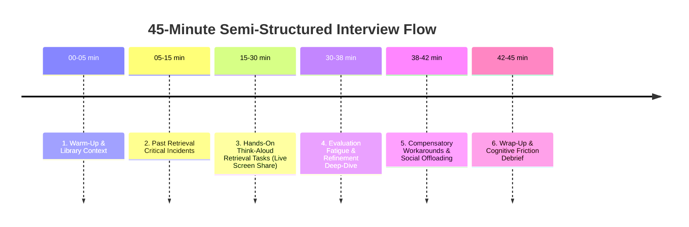
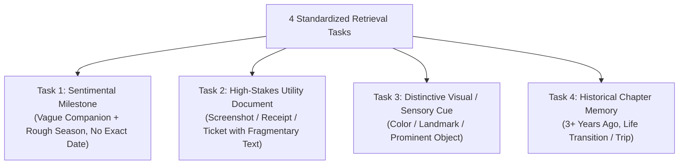
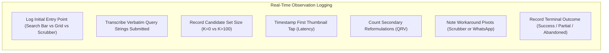
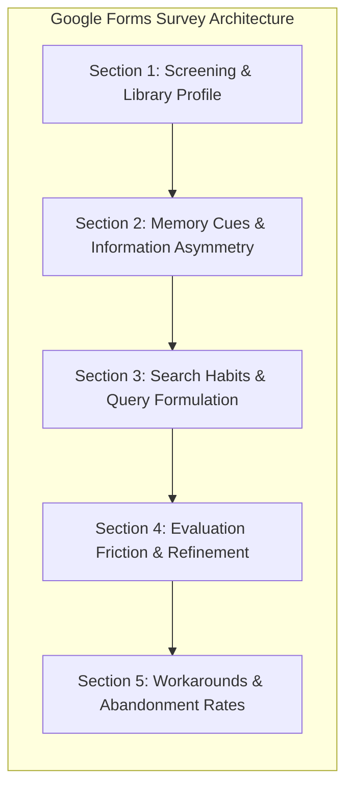
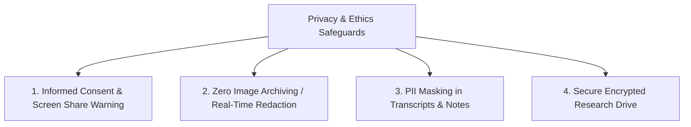

# Google Photos Discovery Engine — Part 3: User Research Framework & Protocol

**Project:** NextLeap Product Management Graduation Project — Part 3  
**Product:** Google Photos (Core Experience Team)  
**Research Focus:** Primary Qualitative & Behavioral Investigation of Vague Photo Retrieval Friction  
**Document:** `docs/part3-user-research.md`  
**Date:** September 2026  
**Status:** COMPLETE RESEARCH INSTRUMENTATION (No Fabricated Participants or Responses)  

---

> [!IMPORTANT]
> **Methodological Invariant & Epistemic Boundary**:
> In accordance with NextLeap graduation project standards, this document **does not fabricate participants, synthetic interviews, or simulated survey results**. Instead, it establishes an end-to-end, empirical user research plan directly addressing the research gaps, behavioral stages, and findings established in [part1-discovery-report.md](file:///c:/Users/anshy/OneDrive/Desktop/NextLeap%20Projects/Graduation%20Project%20-%20Sep%202026(Google%20Photos)/docs/part1-discovery-report.md) and [part2-metric-decomposition.md](file:///c:/Users/anshy/OneDrive/Desktop/NextLeap%20Projects/Graduation%20Project%20-%20Sep%202026(Google%20Photos)/docs/part2-metric-decomposition.md).

---

## Table of Contents

1. [Executive Summary & Research Objectives](#1-executive-summary--research-objectives)
2. [Target Participant Segmentation & Sampling Matrix](#2-target-participant-segmentation--sampling-matrix)
3. [Participant Screener & Qualifying Logic](#3-participant-screener--qualifying-logic)
4. [Semi-Structured Interview Guide (5–6 Sections)](#4-semi-structured-interview-guide-56-sections)
5. [Hands-On Think-Aloud Retrieval Tasks](#5-hands-on-think-aloud-retrieval-tasks)
6. [Researcher Observation Protocol & Behavioral Rubric](#6-researcher-observation-protocol--behavioral-rubric)
7. [Google Forms Survey Questionnaire Specification](#7-google-forms-survey-questionnaire-specification)
8. [Google Sheets Response Logging & Analysis Template](#8-google-sheets-response-logging--analysis-template)
9. [Ethical Protocols, Privacy & Data Handling](#9-ethical-protocols-privacy--data-handling)
10. [Traceability to Part 1 Findings & Part 2 Gaps](#10-traceability-to-part-1-findings--part-2-gaps)

---

## 1. Executive Summary & Research Objectives

### 1.1 Context
In Part 1, the Discovery Engine mined 74 authentic public records (72 Problem B retrieval friction records) across Google Play, App Store, Reddit, and Google Photos Community forums. In Part 2, the business metric (*"Successful retrieval of vaguely remembered photos"*) was decomposed into a 6-stage funnel ($P(E_1)$ to $P(E_6)$) and telemetry indicators.

However, public review data has three inherent research gaps identified in Part 2:
1. **Unobservable In-Session Micro-Dynamics**: Public reviews describe emotional outcomes ("I can never find anything") rather than exact second-by-second search formulations, facet clicks, or thumbnail rejections.
2. **True Session Duration & Refinement Fatigue**: Public reviews cannot measure exact dwell times, the specific number of keyword reformulations before giving up, or the psychological transition point where a user pivots to manual timeline scrolling.
3. **Silent Success vs. Silent Abandonment**: We must observe users searching their *own live libraries* in real time to capture both subtle micro-frustrations and unlogged workarounds.

### 1.2 Core Research Objectives
- **Objective 1 (Formulation & Cognitive Gaps)**: Unpack how users mentally represent vague memories and transcribe them into search inputs when exact calendar dates are forgotten (observed in 100% of Part 1 records).
- **Objective 2 (Evaluation & Grid Fatigue)**: Measure cognitive load, scanning velocity, and failure points when users encounter large ($>100$) candidate grids.
- **Objective 3 (Workaround & Exit Triggers)**: Identify the exact friction threshold that prompts users to abandon the search bar in favor of manual timeline scrubbing (65.3% in Part 1) or external messaging apps (34.7% in Part 1).
- **Objective 4 (Stakes Asymmetry)**: Directly compare user behavior across sentimental memory retrieval (trips, milestones, passed pets) versus functional utility retrieval (screenshots, receipts, tickets).

---

## 2. Target Participant Segmentation & Sampling Matrix

To isolate retrieval friction from unrelated app issues, participants must represent diverse operating systems, library scales, and photo habits while strictly filtering out Problem A (sync/backup loss) cases.

```mermaid
quadrantChart
    title Target Participant Sampling Matrix
    x-axis Sentimental / Personal Memory Focus --> Utility / Transactional Document Focus
    y-axis Low Library Scale (2k - 5k Photos) --> Large Library Scale (15k - 50k+ Photos)
    quadrant-1 Heavy Utility & Screenshot Archivist
    quadrant-2 Power Memory Hoarder & Family Historian
    quadrant-3 Casual Mobile Photographer
    quadrant-4 Transactional Document Searcher
    "Segment A: Sentimental Power User": [0.25, 0.85]
    "Segment B: Utility & Screenshot Hoarder": [0.85, 0.75]
    "Segment C: Cross-Platform Switcher": [0.45, 0.40]
    "Segment D: Casual Everyday Chronicler": [0.30, 0.30]
```

### 2.1 Segment Profiles

| Segment ID | Segment Name | Target Library Size | Primary Use Case & Characteristics | Key Part 1 Cluster Alignment |
| :--- | :--- | :---: | :--- | :--- |
| **SEG-A** | **Sentimental Power User** | 15,000+ photos (5+ years) | Family milestones, travel, pets, kids; searches by vague emotional or visual cues. | `CLUST-01`, `CLUST-02`, `CLUST-03` |
| **SEG-B** | **Utility & Screenshot Archivist** | 5,000+ photos (high screenshot ratio $>20\%$) | Receipts, payment confirmations, prescriptions, Wi-Fi passwords, infographics. | `CLUST-06` (Screenshot/OCR breakdown) |
| **SEG-C** | **Cross-Platform / Restored User** | 10,000+ photos | Switched between iOS/Android or restored library from Google Takeout/iCloud. | `CLUST-03` (Chronological disorientation) |
| **SEG-D** | **Casual Everyday Chronicler** | 2,000–8,000 photos | Daily snapshots, social outings; relies on automated Google Photos memories. | `CLUST-11` (Evaluation exhaustion) |

### 2.2 Recommended Participant Cohort Size
- **Total Depth Interviews**: 6 to 8 participants (split evenly: 3 Android, 3 iOS, 1–2 Web/cross-platform).
- **Survey Sample**: 40 to 60 respondents across Google Forms for quantitative funnel verification.

---

## 3. Participant Screener & Qualifying Logic

The screener filters for active users facing **Problem B (Retrieval Friction)** while disqualifying users facing **Problem A (Backup Loss / Storage Outage)**.



### 3.1 Screener Questionnaire

#### Question 1: Platform & Primary Gallery App
- **Question**: Which mobile operating system and primary photo management tool do you use on your personal phone?
  - A) Android — Google Photos is my primary gallery *(Qualifies)*
  - B) iPhone / iOS — Google Photos app installed and backed up *(Qualifies)*
  - C) iPhone / iOS — Apple Photos only (do not use Google Photos) *(Disqualify)*
  - D) Android — Local gallery only (cloud backup disabled) *(Disqualify)*

#### Question 2: Cloud Library Size & Age
- **Question**: Approximately how many photos and videos are stored in your Google Photos library, and how long have you used the service?
  - A) Fewer than 1,000 photos / Used for less than 6 months *(Disqualify)*
  - B) 1,000 – 4,999 photos / Used for 1–3 years *(Qualifies for SEG-D)*
  - C) 5,000 – 19,999 photos / Used for 3–7 years *(Qualifies for SEG-A, SEG-B, or SEG-C)*
  - D) 20,000+ photos / Used for 7+ years *(Qualifies for SEG-A or SEG-B)*

#### Question 3: Problem Demarcation (Problem B vs. Problem A Filter)
- **Question**: Which of the following best describes your primary frustration with Google Photos over the past 6 months?
  - A) "Google Photos deleted my pictures" or "My cloud storage is full and won't sync" *(Disqualify: Problem A - Backup / Data Availability)*
  - B) "I know I took or saved a photo, it's definitely in my library, but searching or scrolling for it is painful or unsuccessful" *(Qualifies: Problem B - Core Retrieval Friction)*
  - C) "Photo editing tools and filters are slow or low quality" *(Disqualify: Unrelated Feature)*
  - D) "I never search for old photos; I only view the latest camera shots" *(Disqualify: Inactive Search User)*

#### Question 4: Retrieval Experience & Memory Cues
- **Question**: When trying to find a specific older photo or document that you remember, how often do you experience difficulty because you cannot remember the exact date it was taken?
  - A) Frequently (multiple times a month) *(High Priority Candidate)*
  - B) Occasionally (once every few months) *(Acceptable Candidate)*
  - C) Never — I always remember exact dates or have organized albums *(Disqualify)*

#### Question 5: Library Content Composition
- **Question**: What types of media make up a significant portion of your Google Photos library? (Select all that apply)
  - [ ] Personal family, friends, and social snapshots *(SEG-A / SEG-D)*
  - [ ] Travel and vacation photos *(SEG-A)*
  - [ ] Screenshots of payments, receipts, orders, or chats *(SEG-B)*
  - [ ] Work/study documents, whiteboards, or recipes *(SEG-B)*
  - [ ] Photos migrated from older phones, iCloud, or hard drives *(SEG-C)*

---

## 4. Semi-Structured Interview Guide (5–6 Sections)

**Format:** 45-minute remote session via Google Meet / Zoom with screen sharing of the participant’s mobile device.  
**Tone:** Neutral, open-ended, non-leading. Avoid priming the user with terms like "AI search" or "semantic tagging."



### Section 1: Warm-Up & Photo Library Context (5 mins)
- *Goal*: Build rapport and understand the participant's mental model of their library.
- **Q1.1**: "Walk me through how photos get into your Google Photos. What do you use the app for on an average week?"
- **Q1.2**: "Roughly how many photos are in your library, and how far back does your collection go?"
- **Q1.3**: "How organized would you say your library is? Do you create albums, tag faces, or let everything sit in the main photo stream?"

### Section 2: Critical Incident Recall — Past Retrieval Breakdown (10 mins)
- *Goal*: Unpack a real, unprompted episodic retrieval attempt from recent memory.
- **Q2.1**: "Think back to the last time you tried to find an older photo or screenshot where you remembered what it looked like, but couldn't locate it right away. What were you looking for?"
- **Q2.2**: "What specific details did you recall before you started searching? (Probe: Did you remember a color? A season? A person? A city? Visible words?)"
- **Q2.3**: "What did you *not* know? Did you know the month or year?" *(Validates Part 1 Finding 3)*
- **Q2.4**: "What was the very first action you took inside the app? Did you type in the search bar, tap a filter, or scroll?" *(Validates Part 1 Finding 4)*
- **Q2.5**: "What happened next? What did Google Photos show you, and how did you feel looking at those results?"

### Section 3: Live Think-Aloud Retrieval Tasks (15 mins)
- *Goal*: Observe real-time behavioral friction and verify telemetry assumptions.
- *(Administer Tasks 1–4 from Section 5 of this document while participant shares screen).*
- *Prompt*: "Please think out loud as you search. Tell me what you're typing, what you're noticing on screen, and why you choose to tap or scroll."

### Section 4: Result Evaluation & Cognitive Fatigue (8 mins)
- *Goal*: Investigate the `RESULT_EVALUATION` and `SEARCH_REFINEMENT` bottlenecks.
- **Q4.1**: "When the search returned a grid of results, how did you decide whether to keep scrolling through them or try a different approach?"
- **Q4.2**: "Did you feel confident the photo was in that list and you just had to spot it, or did you feel the search had failed?"
- **Q4.3**: "When a search returned too many photos (e.g., 200+), what tools did you look for to narrow it down? Were those tools easy or frustrating to use?" *(Validates Part 1 Finding 5 & 6)*
- **Q4.4**: "How do you tell similar photos apart when scanning through tiny thumbnails on your phone screen?"

### Section 5: Compensatory Workarounds & Abandonment (5 mins)
- *Goal*: Validate Part 1 Finding 7 (timeline scrolling, WhatsApp offloading, total abandonment).
- **Q5.1**: "When you can't find a photo via the search bar, what is your next fallback move?"
- **Q5.2**: "Have you ever spent 10+ minutes dragging the timeline scrubber back through previous years? What was that experience like?"
- **Q5.3**: "Have you ever given up on Google Photos and searched WhatsApp, iMessage, or asked someone to re-send it to you? Why was that easier than finding it in your own gallery?"
- **Q5.4**: "At what point do you say, 'Forget it, I'm never going to find this,' and close the app?"

### Section 6: Wrap-Up & Retrospective Reflection (2 mins)
- *Goal*: Synthesize overall sentiment and high-level expectations.
- **Q6.1**: "If Google Photos could understand one piece of information about how your memory works, what would you want it to know?"
- **Q6.2**: "Is there anything about how you look for old photos that we haven't touched on today?"

---

## 4. Hands-On Think-Aloud Retrieval Tasks

During the live session, participants execute 4 standardized retrieval tasks using their **own real device and library**. The researcher does **not** provide search queries or hints.



### Task 1: Sentimental Memory with Fuzzy Temporal Cue
- **Prompt to Participant**:  
  *"Think of a candid photo or gathering with a specific friend, relative, or pet from roughly 2 to 4 years ago. You remember who was with you or what the weather/season felt like, but you do NOT know the exact date or month. Please try to locate that photo now."*
- **Target Observation**:
  - Does the user type names into the search bar, tap the People & Pets grid, or manually scroll?
  - When search returns dozens of photos of that person, how does the user filter by the approximate season?
  - Max time limit: 4 minutes.

### Task 2: High-Stakes Utility / Transactional Capture
- **Prompt to Participant**:  
  *"Think of a screenshot, receipt, booking confirmation, physical document, or ticket you saved over 6 months ago that you might need for verification. You know roughly what store, event, or document type it was, but not when you took it. Please locate it."*
- **Target Observation**:
  - Does OCR return the visible text?
  - Does the user look for a "Screenshots" or "Documents" filter chip, or use raw search?
  - Does the user encounter the metadata stripping breakdown identified in Part 1 Finding 8?
  - Max time limit: 3 minutes.

### Task 3: Sensory / Distinctive Visual Feature
- **Prompt to Participant**:  
  *"Think of a photo where you distinctly remember a visual color or object—for example, a bright red car, a wooden dining table, a sunset at a lake, or someone wearing a funny hat—from anytime in your library. Please locate it using that visual clue."*
- **Target Observation**:
  - How does the participant phrase sensory adjectives (e.g., `"yellow wall"`, `"wooden bench"`)?
  - Does semantic search understand compound descriptive phrases or return false positives?
  - Max time limit: 3 minutes.

### Task 4: Historical Chapter Memory (3+ Years Ago)
- **Prompt to Participant**:  
  *"Try to find a photo from a memorable trip, concert, or celebration that happened at least 3 years ago. You remember the city or event, but you are not sure of the exact year."*
- **Target Observation**:
  - Does the user scroll back through the timeline scrubber?
  - How many screen lengths do they scrub before getting disoriented?
  - Do restored photos appear out of order (Cluster `CLUST-03`)?
  - Max time limit: 4 minutes.

---

## 6. Researcher Observation Protocol & Behavioral Rubric

While observing the participant's screen share, the researcher completes this structured rubric in real time for **each retrieval task**.



### 6.1 Task Observation Sheet

| Metric / Dimension | Observation Field | Coding Options / Values | Part 2 Telemetry Counterpart |
| :--- | :--- | :--- | :--- |
| **Participant ID** | e.g., `P-01` | String | User ID |
| **Task ID** | Task 1, 2, 3, or 4 | Enum | Task Scenario |
| **Initial Entry Point** | Where did the user start? | `SEARCH_BAR`, `PEOPLE_PETS_TAB`, `TIMELINE_SCRUBBER`, `DOCUMENTS_TAB`, `ALBUMS` | Entry Point Distribution |
| **First Query String** | Verbatim query entered | e.g., `"red shirt cafe rome"` | Formulation Analysis |
| **Candidate Count ($K$)** | Number of photos returned | `0` (Zero-hit), `1-10`, `11-50`, `51-200`, `200+` | Zero-Hit Rate ($\text{ZHQR}$) |
| **Time to First Tap** | Seconds from results to first thumbnail view | Number (seconds) | First Tap Latency |
| **Total Query Reformulations** | Number of query revisions | Integer (0, 1, 2, 3+) | Query Reformulation Velocity ($\text{QRV}$) |
| **Grid Dwell Time** | Seconds spent scanning grid | Number (seconds) | Evaluation Dwell Latency ($\text{EDL}$) |
| **Thumbnails Inspected** | Full-screen views opened | Integer | Inspection Ratio ($\text{TIRR}$) |
| **Filter / Facet Usage** | Did user apply facet chips? | `NONE`, `DATE_RANGE`, `PEOPLE_FILTER`, `LOCATION_FILTER`, `DOC_TYPE` | Facet Adoption ($\text{FIAR}$) |
| **Workaround Triggered** | Did user abandon search for fallback? | `TIMELINE_SCRUBBER_FALLBACK`, `EXTERNAL_APP_CHECK`, `NONE` | Scrubber Fallback Rate ($\text{STFR}$) |
| **Time to Resolution / Abandon** | Total task duration | Number (seconds) | Total Task Dwell Time |
| **Terminal Task Outcome** | Final task result | `SUCCESSFUL_RETRIEVAL`, `PARTIAL_SUCCESS`, `FAILED_RETRIEVAL`, `ABANDONED` | Vague Retrieval Success Rate ($\text{VRSR}$) |
| **Primary Failure Stage** | Where did breakdown occur? | `QUERY_FORMULATION`, `RETRIEVAL_RELEVANCE`, `RESULT_EVALUATION`, `SEARCH_REFINEMENT`, `METADATA_INDEXING`, `NAVIGATION` | Failure Stage Taxonomy |
| **User Verbalization / Quote** | Verbatim quote during friction | e.g., *"Why is it showing me photos of cars when I typed yellow coat?"* | Qualitative Evidence |

---

## 7. Google Forms Survey Questionnaire Specification

For quantitative validation across a broader sample ($N=40-60$), the following survey structure is formatted for immediate entry into Google Forms.



### Form Configuration
- **Title**: Google Photos Memory Retrieval Experience Survey
- **Form Description**: *This study explores how people search for and find older memories, photos, and screenshots in Google Photos when they remember what the photo looked like but cannot recall the exact date.*
- **Settings**: Collect email addresses: No (Anonymous); Require sign-in: No; Shuffle question order: No.

### Survey Questions Specification Table

| # | Question Title | Question Type | Options / Help Text | Mandatory | Skip / Logic Branching |
| :-: | :--- | :--- | :--- | :-: | :--- |
| **Q1** | What operating system is on your primary personal phone? | Multiple Choice | - Android<br>- Apple iPhone (iOS)<br>- Other | Yes | If "Other" $\rightarrow$ End Form |
| **Q2** | Do you actively use Google Photos to store or view your pictures? | Multiple Choice | - Yes, as my primary photo app<br>- Yes, as a secondary cloud backup<br>- No, I do not use Google Photos | Yes | If "No" $\rightarrow$ End Form |
| **Q3** | Approximately how many photos and videos are stored in your Google Photos library? | Multiple Choice | - Under 1,000 photos<br>- 1,000 to 4,999 photos<br>- 5,000 to 14,999 photos<br>- 15,000 to 30,000 photos<br>- More than 30,000 photos | Yes | If "Under 1,000" $\rightarrow$ End Form |
| **Q4** | How often do you search for an older photo, video, or screenshot where you remember what it was, but NOT the exact date? | Multiple Choice | - Multiple times a week<br>- A few times a month<br>- Once every few months<br>- Almost never | Yes | If "Almost never" $\rightarrow$ End Form |
| **Q5** | When you search for a remembered photo, what clues do you usually remember? (Select all that apply) | Checkboxes | - Approximate time or season (e.g., "last summer", "around college")<br>- Visual colors or appearance (e.g., "blue dress", "wooden table")<br>- People or pets in the photo<br>- General place or city<br>- Visible words or text in the image<br>- Exact calendar date (Month and Year) | Yes | None |
| **Q6** | How often do you remember the exact calendar date (month/year) when you start searching for an old photo? | Linear Scale (1-5) | 1 = Never remember exact date<br>5 = Always remember exact date | Yes | None |
| **Q7** | What is your first instinct when you need to find an old, vaguely remembered photo? | Multiple Choice | - Type keywords into the Google Photos search bar<br>- Scroll backwards manually along the main photos timeline<br>- Go to the "People & Pets" section<br>- Check an existing album<br>- Search external messaging apps (WhatsApp, iMessage) where I sent it | Yes | None |
| **Q8** | What happens most frequently when you type a descriptive query into the Google Photos search bar? | Multiple Choice | - It returns exactly the photo I want right away<br>- It returns hundreds of photos, and I have to scroll through clutter<br>- It returns zero results ("No results found")<br>- It returns completely irrelevant photos that don't match | Yes | None |
| **Q9** | If a search returns too many results (e.g., 200+ photos), what do you do next? | Multiple Choice | - Give up on search and manually scroll through the main library<br>- Change or swap keywords in the search bar multiple times<br>- Use filters (People, Places, Dates) to narrow it down<br>- Give up and stop looking completely | Yes | None |
| **Q10** | Have you ever spent more than 10 minutes dragging the timeline scrollbar backwards looking for a photo? | Multiple Choice | - Yes, frequently<br>- Yes, once or twice<br>- No, never | Yes | None |
| **Q11** | Have you ever given up on Google Photos and asked a friend/family member to send you a photo instead? | Multiple Choice | - Yes, frequently<br>- Yes, occasionally<br>- No, never | Yes | None |
| **Q12** | Out of your last 5 attempts to find an older photo, how many were successful? | Dropdown | - 5 out of 5 (100% success)<br>- 3 or 4 out of 5<br>- 1 or 2 out of 5<br>- 0 out of 5 (None found) | Yes | None |
| **Q13** | In your own words, what is the most frustrating part of trying to find an older photo in Google Photos? | Paragraph | Free text (Open-ended user voice) | No | None |

---

## 8. Google Sheets Response Logging & Analysis Template

To ensure immediate compatibility with Google Sheets, below is the tabular data schema, field headers, and a CSV-formatted blueprint ready for copy-pasting.

### 8.1 Google Sheets Column Header Schema

```
A: Response_ID
B: Timestamp
C: OS_Platform
D: Library_Size_Tier
E: Vague_Search_Frequency
F: Retained_Cue_Temporal
G: Retained_Cue_Visual
H: Retained_Cue_People
I: Retained_Cue_Spatial
J: Retained_Cue_Text
K: Retained_Cue_ExactDate
L: Exact_Date_Recall_Score (1-5)
M: Primary_Initial_Entry_Point
N: Primary_Search_Failure_Mode
O: Secondary_Iteration_Action
P: Timeline_Scrubber_Fallback_History
Q: External_App_Offload_History
R: Self_Reported_Success_Ratio
S: Open_Feedback_Verbatim
T: Problem_Category (Prob B vs Prob A)
U: Coded_Failure_Stage
```

### 8.2 CSV-Ready Header & Data Schema Template

```csv
Response_ID,Timestamp,OS_Platform,Library_Size_Tier,Vague_Search_Frequency,Retained_Cue_Temporal,Retained_Cue_Visual,Retained_Cue_People,Retained_Cue_Spatial,Retained_Cue_Text,Retained_Cue_ExactDate,Exact_Date_Recall_Score,Primary_Initial_Entry_Point,Primary_Search_Failure_Mode,Secondary_Iteration_Action,Timeline_Scrubber_Fallback_History,External_App_Offload_History,Self_Reported_Success_Ratio,Open_Feedback_Verbatim,Problem_Category,Coded_Failure_Stage
RESP-TEMPLATE-01,,Android,15k-30k,Multiple times a month,TRUE,TRUE,TRUE,FALSE,FALSE,FALSE,1,SEARCH_BAR,RESULT_OVERLOAD,KEYWORD_SWAP,YES_FREQUENTLY,YES_OCCASIONALLY,1-2 out of 5,,PROBLEM_B,RETRIEVAL_RELEVANCE
RESP-TEMPLATE-02,,iOS,5k-15k,A few times a month,TRUE,TRUE,FALSE,TRUE,FALSE,FALSE,2,SEARCH_BAR,ZERO_RESULTS,TIMELINE_SCROLL,YES_OCCASIONALLY,YES_FREQUENTLY,3-4 out of 5,,PROBLEM_B,SEARCH_REFINEMENT
```

### 8.3 Google Sheets In-Sheet Pivot & Formula Specifications

To analyze the survey data automatically in Google Sheets, researchers can configure the following formulas:

1. **Exact Date Amnesia Rate (validating 100% Part 1 baseline)**:
   ```excel
   =COUNTIF(K2:K, FALSE) / COUNTA(K2:K)
   ```
2. **Search Bar Entry Dominance (validating 84.7% Part 1 baseline)**:
   ```excel
   =COUNTIF(M2:M, "SEARCH_BAR") / COUNTA(M2:M)
   ```
3. **Timeline Scrubbing Workaround Rate (validating 65.3% Part 1 baseline)**:
   ```excel
   =COUNTIF(P2:P, "YES*") / COUNTA(P2:P)
   ```
4. **External App Offloading Rate (validating 34.7% Part 1 baseline)**:
   ```excel
   =COUNTIF(Q2:Q, "YES*") / COUNTA(Q2:Q)
   ```
5. **Self-Reported Vague Retrieval Success Rate**:
   ```excel
   =AVERAGE(IF(R2:R="5 out of 5", 1.0, IF(R2:R="3 or 4 out of 5", 0.7, IF(R2:R="1 or 2 out of 5", 0.3, 0.0))))
   ```

---

## 9. Ethical Protocols, Privacy & Data Handling

Because photo libraries contain sensitive personal data (faces, family members, geolocation, documents, financial screenshots), this research protocol enforces strict privacy safeguards:



1. **Informed Consent**: Participants sign an NDA and consent agreement explicitly stating that screen sharing is conducted solely for real-time behavioral observation, not for media extraction.
2. **Zero Image Recording**: Researchers record only interaction sequences (keystrokes, taps, scroll velocities, and audio). Video recordings must obscure or crop out full-screen personal photos; screenshots of personal photos are strictly forbidden.
3. **Sensitive Media Protocol**: Before beginning Task 2 (utility receipts/documents), participants are reminded: *"If you locate a document containing credit card numbers, passwords, or personal health identifiers, please do not open it full screen. Simply tell the researcher: 'I located the document.'"*
4. **PII Anonymization**: Participant names, usernames, and family names are coded (e.g., `P-01`, `P-02`) in all research notes, Google Forms entries, and Sheets summaries.

---

## 10. Traceability to Part 1 Findings & Part 2 Gaps

This research framework directly bridges the empirical findings from Part 1 and the research gaps flagged in Part 2:

| Research Gap / Finding | Part 1 / Part 2 Origin | Corresponding Instrument in Part 3 Protocol | Methodological Verification |
| :--- | :--- | :--- | :--- |
| **Exact Date Forgotten** | Finding 3 (`FINDING-03`); 100% of Part 1 records | Screener Q4, Survey Q6, Interview Q2.3, Tasks 1–4 | Quantifies whether users can formulate queries without calendar metadata. |
| **Stakes Asymmetry (Utility vs. Sentimental)** | Finding 1 (`FINDING-01`); Cluster `CLUST-06` | Task 1 (Sentimental) vs. Task 2 (Utility Receipt); Interview Q2.1 | Directly compares abandonment dwell time between emotional photos and utility receipts. |
| **Search Bar Entry vs. Facet Underutilization** | Finding 4 (`FINDING-04`); 84.7% keyword searches | Observation Rubric ("Initial Entry Point"); Survey Q7; Interview Q2.4 | Measures how often users bypass existing People/Places tabs in favor of raw text. |
| **Evaluation Cognitive Exhaustion** | Finding 5 (`FINDING-05`); Cluster `CLUST-11` | Interview Section 4; Observation Metric ("Thumbnails Inspected", "Grid Dwell Time") | Validates whether large candidate grids cause user drop-off before locating photos. |
| **Compensatory Timeline Scrubbing** | Finding 7 (`FINDING-07`); 65.3% workaround rate | Survey Q10; Observation Rubric ("Workaround Triggered"); Interview Section 5 | Measures the exact seconds and scroll distance before a user abandons search for timeline drag. |
| **External Messaging Offloading** | Finding 7 (`FINDING-07`); 34.7% external app rate | Survey Q11; Interview Q5.3 | Unpacks why WhatsApp/iMessage conversational search feels faster than Google Photos. |
| **Contradictory Variance (Camera vs. Screenshot)** | Finding 8 (`FINDING-08`); Media origin contradiction | Task 2 (Screenshot) vs. Task 3 (Camera Photo); Screener Q5 | Tests whether stripped EXIF and OCR latency cause acute search failure in real-time tasks. |
| **Unobservable In-Session Dwell Time** | Part 2 Research Gap (`part2-metric-decomposition.md` §8) | Observation Sheet: Time to first tap, Grid dwell time, Total task duration | Measures millisecond telemetry impossible to extract from public app store reviews. |

---

## Summary

This user research plan completes Part 3 of the NextLeap Product Management framework. It equips the team with a fully operational, privacy-compliant, and empirically grounded methodology to observe real users navigating their actual photo libraries—providing the qualitative and behavioral depth needed for Part 4 solution exploration.
