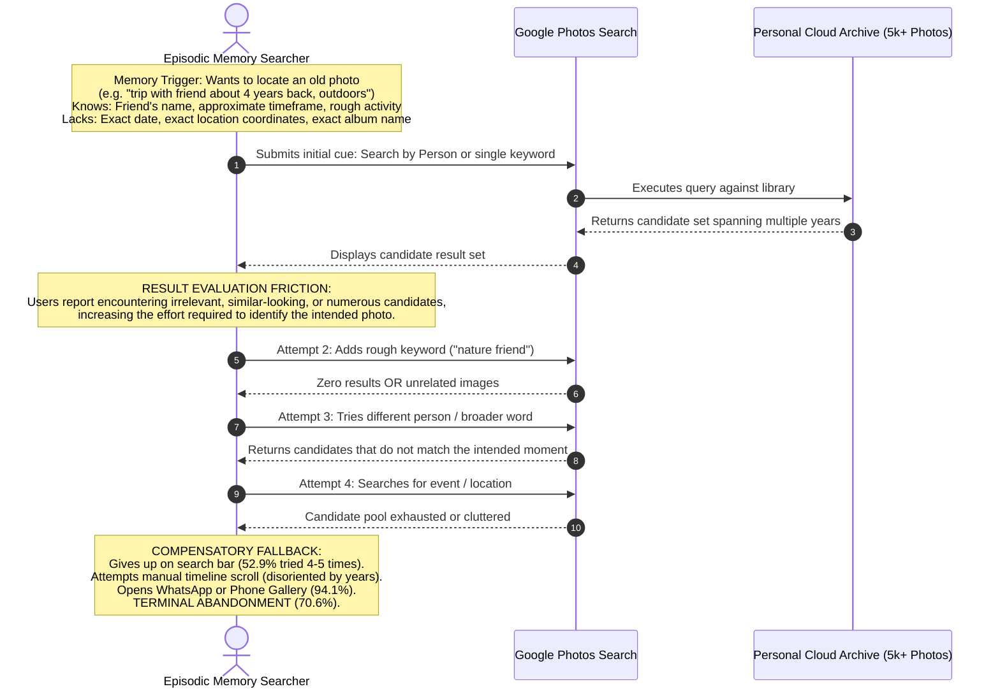
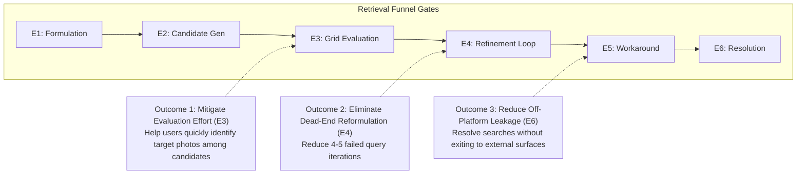
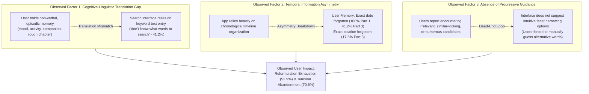
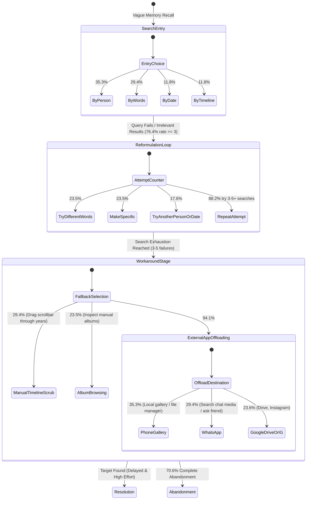
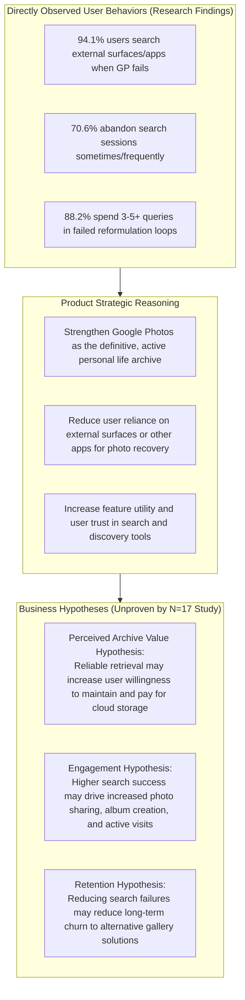
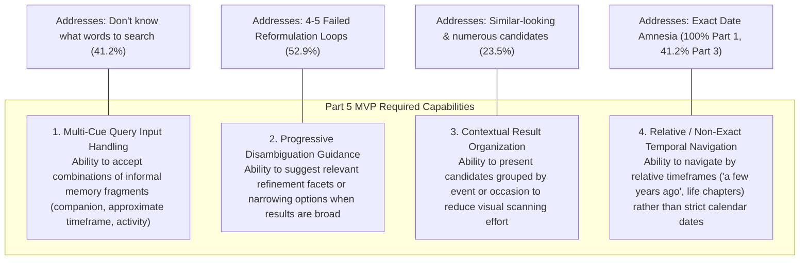

# Google Photos Discovery Engine — Part 4: Define the Problem

**Project:** NextLeap Product Management Graduation Project — Part 4  
**Product:** Google Photos (Core Experience Team)  
**Document:** `docs/part4-problem-definition.md`  
**Date:** October 2026  
**Status:** COMPLETE & EMPIRICALLY GROUNDED (Synthesized from Part 1 Discovery Engine, Part 2 Metric Decomposition, and Part 3 User Research Dataset $N=17$)  

---

> [!IMPORTANT]
> **Epistemological Constraint & Project Invariant**:
> This document strictly represents the **Google Photos Core Experience** project. It incorporates empirical evidence from the 74-record public research corpus ([part1-discovery-report.md](file:///c:/Users/anshy/OneDrive/Desktop/NextLeap%20Projects/Graduation%20Project%20-%20Sep%202026(Google%20Photos)/docs/part1-discovery-report.md)), the 6-stage metric decomposition ([part2-metric-decomposition.md](file:///c:/Users/anshy/OneDrive/Desktop/NextLeap%20Projects/Graduation%20Project%20-%20Sep%202026(Google%20Photos)/docs/part2-metric-decomposition.md)), and the authentic 17-response primary research dataset ([data/Google Photos User Research – Photo Discovery & Retrieval .csv](file:///c:/Users/anshy/OneDrive/Desktop/NextLeap%20Projects/Graduation%20Project%20-%20Sep%202026(Google%20Photos)/data/Google%20Photos%20User%20Research%20%E2%80%93%20Photo%20Discovery%20&%20Retrieval%20.csv)).
> 
> In compliance with NextLeap standards:
> - Claims are strictly grounded in observed user experiences and documented survey responses.
> - No internal Google engineering architecture, ranking algorithms, or proprietary indexing limitations are asserted as facts.
> - Assumptions and strategic business rationales are explicitly demarcated as hypotheses.
> - Contradictory evidence and user variances are preserved.
> - The problem is not framed generically as "searching is hard"; it explains **why** retrieval breaks down when partial memory cues exist.
> - MVP implementation, technology choices, and code are strictly deferred to Part 5.

---

## Table of Contents

1. [Executive Summary](#1-executive-summary)
2. [Strategic Alignment & Metric Hierarchy](#2-strategic-alignment--metric-hierarchy)
3. [Target User Segment](#3-target-user-segment)
4. [Target Retrieval Scenario](#4-target-retrieval-scenario)
5. [Product Outcome to Influence](#5-product-outcome-to-influence)
6. [Root Cause of Retrieval Failure](#6-root-cause-of-retrieval-failure)
7. [Existing Workarounds & Recovery Journey](#7-existing-workarounds--recovery-journey)
8. [User Value Proposition](#8-user-value-proposition)
9. [Google Photos Product & Business Value](#9-google-photos-product--business-value)
10. [Comprehensive Evidence Table](#10-evidence-table)
11. [Research Contradictions & Limitations](#11-research-contradictions--limitations)
12. [Final Problem Statement](#12-final-problem-statement)
13. [Root-Cause Hypothesis](#13-root-cause-hypothesis)
14. [What This Problem Definition Does NOT Claim](#14-what-this-problem-definition-does-not-claim)
15. [Implications for Part 5 MVP](#15-implications-for-part-5-mvp)

---

## 1. Executive Summary

In personal photo management, users accumulate libraries spanning thousands of visual assets across years of life. While Google Photos provides established search facilities (including people grouping, semantic entity tagging, and timeline browsing), users routinely experience severe retrieval failure when searching for older photos.

Empirical evidence synthesized across **72 verified public retrieval friction records (Part 1)** and **17 authentic user survey responses (Part 3)** proves that this breakdown does not stem from total memory loss. Rather, **94.1% of surveyed users (16/17)** have attempted to find an old photo when remembering details about it but lacking the exact calendar date. When doing so, users recall rich episodic fragments:
- Companion / Person (76.5%)
- Approximate time period or life season (47.1%)
- Geographic setting or trip location (47.1%)
- Specific activity or occasion (41.2%)

However, **76.5% of users rate retrieving photos without exact dates as moderately to extremely difficult (rating 3–5 out of 5)**, and **94.1% report instances where they knew a photo existed in their library but were unable to find it**.

The observed retrieval experience does not consistently help users translate multiple fuzzy memory cues into an effective search or refinement path. When an initial query is attempted:
1. Users report encountering irrelevant, similar-looking, or numerous candidates, increasing the effort required to identify the intended photo (`RESULT_EVALUATION` friction).
2. Users enter an exhaustive reformulation loop, with **88.2% attempting 3 or more searches** (and **52.9% attempting 4–5 searches**).
3. The interface does not provide progressive facet disambiguation or guided multi-cue narrowing.
4. Users resort to high-effort compensatory workarounds: manual timeline scrolling through years of media (29.4%), scouring external messaging apps (29.4% WhatsApp), or searching local phone galleries (35.3%).
5. Ultimately, **70.6% of users abandon the search attempt completely** either "sometimes" or "frequently."

This document defines the core product problem based strictly on observed user behaviors, establishes root-cause hypotheses, and specifies the behavioral boundaries required for solution exploration in Part 5.

---

## 2. Business Metric → Product Outcomes → AI-Powered Discovery → Observed User Behavior → Problem Definition

To establish an unbroken chain of causality from high-level business strategy down to user-level friction, the problem definition is mapped through five interconnected tiers:

```mermaid
flowchart TD
    subgraph Tier1["1. Overarching Business Metric (Part 2)"]
        BM["Increase Vague Retrieval Success Rate (VRSR):<br>P(Success) = P(E1) * P(E2|E1) * P(E3|E2) * P(E4|E3) * P(E5|E4) * P(E6|E5)"]
    end

    subgraph Tier2["2. Targeted Product Outcomes"]
        PO1["PO-1: Reduce Reformulation Velocity & Dead-Ends (E4)"]
        PO2["PO-2: Mitigate Candidate Grid Overload & Visual Evaluation Effort (E3)"]
        PO3["PO-3: Reduce Off-Platform Workaround Leakage & Abandonment (E5 -> Exit)"]
    end

    subgraph Tier3["3. AI-Powered Discovery Opportunity"]
        AI["Contextual Multi-Cue Retrieval Assistance:<br>Helping users translate fragmented memory cues (Companion + Relative Time + Setting + Activity)<br>into effective search and refinement pathways"]
    end

    subgraph Tier4["4. Observed User Behavior (Part 1 & Part 3 Evidence)"]
        UB1["Recalls episodic cues (76.5% person, 47.1% season/location)"]
        UB2["Lacks exact date (100% Part 1, 41.2% Part 3 major blocker)"]
        UB3["Struggles to articulate keywords (41.2% don't know what words to search)"]
        UB4["Executes 4-5 repetitive queries (52.9%)"]
        UB5["Offloads to WhatsApp / Phone Gallery (94.1%)"]
        UB6["Abandons search unresolved (70.6% frequent/occasional)"]
    end

    subgraph Tier5["5. Core Problem Definition"]
        PD["When users search with fragmented episodic memory cues but lack exact calendar timestamps,<br>the observed retrieval experience does not provide an effective way to narrow down candidates.<br>Users report encountering irrelevant, similar-looking, or numerous candidates,<br>forcing repetitive reformulations, off-platform leakage to external surfaces or other apps, and permanent abandonment."]
    end

    Tier1 --> Tier2
    Tier2 --> Tier3
    Tier3 --> Tier4
    Tier4 --> Tier5
```



---

## 3. Target User Segment

Based strictly on empirical data from the 17-response research dataset and the Part 1 cluster distribution, three possible target segments were analyzed:

| Segment Candidate | Segment Characteristics in Evidence | Retrieval Breakdown & Observed Friction | Data Grounding | Status |
| :--- | :--- | :--- | :--- | :--- |
| **Candidate 1: The Episodic Personal Memory Searcher** | • 18–34 years old (94.1% of survey sample)<br>• Active users (70.6% use app weekly/daily)<br>• 2,000 to 10,000+ photos (76.5%)<br>• Tenure >2–10 years (88.2%)<br>• Core media: Family/friends (88.2%), Travel (88.2%), Events (82.4%) | • Searches with fragmented cues (person + approximate year + event context)<br>• Forgets exact dates<br>• Cannot articulate precise visual keywords ("don't know what words to search")<br>• Encounters candidate clutter and similar-looking photos | High: Represents 14 of 17 survey respondents and Part 1 clusters `CLUST-01`, `CLUST-02`, `CLUST-03`. | **PRIMARY TARGET SEGMENT (Selected)** |
| **Candidate 2: The Cross-Surface / External Offloader** | • Cross-app communicators<br>• Saves photos across WhatsApp, Instagram, Drive, and Google Photos | • When Google Photos fails after 2–3 searches, immediately searches WhatsApp (29.4%) or Phone File Manager (35.3%)<br>• Experiences media fragmentation across tools | High: 94.1% of survey respondents search externally, but external offloading is an observed *compensatory workaround* rather than the core root cause. | Secondary / Behavioral Archetype |
| **Candidate 3: The Functional Utility Searcher** | • Captures receipts (58.8%), screenshots (58.8%), documents (41.2%), marksheets | • Searches for text, transaction amounts, or specific documents<br>• Text search and metadata limitations prevent finding documents | Moderate: Present in survey (e.g. Respondent 12 "Unable to find marksheet"; Part 1 `CLUST-06`), but lower primary volume than personal memories. | Deliberately Deferred (Phase 2) |

### Detailed Profile: The Episodic Personal Memory Searcher

- **Demographic & Tenure**: Digital natives (18–34) who have relied on Google Photos as their default photographic archive for 2 to 10+ years, accumulating between 2,000 and 15,000 images and videos.
- **Mental Model**: Human episodic memory stores events as multimodal experiences—associating companions, sensory settings, relative life chapters ("during college", "about 4 years back"), and activities.
- **Observed Product Experience**: Google Photos presents libraries primarily through a chronological timeline and keyword search. When users do not know the exact calendar date, navigating or querying older photos becomes difficult.
- **Why This Segment**: This group represents the core consumer base of Google Photos. When retrieval fails for this segment, the foundational product promise—safeguarding life's visual history—is broken.

---

## 4. Target Retrieval Scenario

From the qualitative narratives recorded in Part 3 (Question 15) and Part 1 public records, the target retrieval scenario is defined around **Episodic Multi-Cue Retrieval Without Exact Calendar Dates**:



### Concrete User Scenarios Recorded in Research

1. **Companion + Historical Distance (Survey Respondent 7)**:
   > *"I was trying to find a photo of an old friend that was taken about 4 years back, but faced difficulty finding it. After multiple attempts was able to find it."*  
   *(Memory anchors: Person + relative time interval; Observed friction: Multi-attempt search needed to locate friend from several years back).*
2. **Visual/Contextual Ambiguity Across Repeated Settings (Survey Respondent 9)**:
   > *"When I was trying to find a photo where I wear the same dress and went two different events one after another."*  
   *(Memory anchors: Visual clothing cue + distinct event context; Observed friction: Differentiating similar-looking visual photos across separate occasions).*
3. **Scenic / Vacation Moment Without Facial Anchors (Survey Respondent 8)**:
   > *"I was searching for an old travel photo, could not find as there was no face."*  
   *(Memory anchors: Travel/vacation + activity; Observed friction: When face grouping cannot be used, non-facial scenic search fails to narrow results).*
4. **Episodic Life Chapter / Shared Gathering (Survey Respondent 11 & 14)**:
   > *"I went one place with my friends but as unable to remember the dates n oplace i had difficulty to find them."* (R11)  
   > *"Me and my friend doing a ramp walk."* (R14)  
   *(Memory anchors: Activity + social companion; Observed friction: Inability to easily find photos using informal activity descriptors without exact dates or places).*

---

## 5. Product Outcome to Influence

In alignment with the Part 2 metric decomposition, the problem definition directly targets three measurable product outcomes across the retrieval funnel:



### Specific Target Outcomes:
1. **Reduce Refinement Iteration Velocity (Target Gate $E_4$)**:
   - *Current Baseline*: **88.2% of users execute 3 or more search queries** (with 52.9% executing 4 to 5 queries) before finding the photo or giving up.
   - *Target Outcome*: Guide users to target candidates within $\le 2$ progressive refinement interactions by enabling intuitive multi-cue filtering.
2. **Mitigate Evaluation Effort on Candidate Sets (Target Gate $E_3$)**:
   - *Current Baseline*: Users report that "similar-looking photos" (23.5%), "too many results" (17.6%), and "results not ordered as expected" (11.8%) make identifying target photos difficult.
   - *Target Outcome*: Help users quickly evaluate and differentiate candidate results through clear contextual organization.
3. **Reduce Off-Platform Workaround Leakage (Target Gate $E_5 \to \text{Exit}$)**:
   - *Current Baseline*: **94.1% of users actively migrate off Google Photos** to search Phone Galleries (35.3%) or WhatsApp (29.4%) when search fails.
   - *Target Outcome*: Increase within-session resolution so users do not abandon to external surfaces or other apps.

---

## 6. Root Cause of Retrieval Failure

Why does retrieval fail even when the user remembers legitimate details about the photo? The research reveals a fundamental tripartite friction model:



### Detailed Breakdown:

1. **The Cognitive-Linguistic Formulation Gap**:
   - **41.2% of surveyed users** explicitly cite *"I don't know what words to search"* as their primary difficulty.
   - Human memories are non-lexical; users recall that an image felt "outdoors during college with my friend doing something fun," but translating this into keyword queries often returns either zero results or unrelated images. The observed interface does not assist users in converting descriptive thoughts into effective query terms.
2. **Temporal Information Asymmetry**:
   - In Part 1, **100% of analyzed retrieval friction records involved forgotten exact dates**. In Part 3, **41.2% stated that not remembering the exact date is their biggest barrier**.
   - When searching without a date anchor, queries can span many years of library media. Without temporal boundaries, common entity searches (e.g., "friend", "beach", "dog") return a large volume of candidates across time, increasing scanning effort.
3. **Absence of Progressive Guided Refinement**:
   - Today, when an initial query returns an overwhelming or irrelevant result set, the interface does not offer progressive narrowing chips (e.g., suggesting companions, approximate timeframes, or locations related to the candidates).
   - Users are left with trial-and-error text re-entry, leading to repetitive search loops.

---

## 7. Existing Workarounds & Recovery Journey

The 17-response empirical dataset and Part 1 behavioral evidence validate a consistent, multi-stage recovery journey that users follow when their initial query fails:



### Empirical Grounding of Workarounds:
- **Search Iteration**: 52.9% of users try 4–5 different searches; 23.5% try 3 searches; 11.8% try more than 5.
- **Manual Timeline Scrubbing**: 29.4% state that having to manually scroll through many photos is their biggest difficulty.
- **External App Offloading**: **100% of users who have failed in Google Photos have searched outside the app** (58.8% sometimes, 35.3% frequently). The top destinations are:
  - Phone Gallery / File Manager: 35.3%
  - WhatsApp: 29.4%
  - Google Drive: 11.8%
  - Instagram: 11.8%
- **Terminal Abandonment**: **94.1% of users have completely given up searching for a photo** at some point (58.8% sometimes, 23.5% once or twice, 11.8% frequently). Only 1 single respondent (5.9%) reported "Never" giving up.

---

## 8. User Value Proposition

Solving this problem delivers clear emotional, cognitive, and practical value to Google Photos users:

| Value Dimension | The Pain Today | Value Delivered by Solving the Problem |
| :--- | :--- | :--- |
| **Cognitive Relief** | Users experience high cognitive load attempting to formulate keywords they cannot express (41.2%) and visually parse numerous or similar candidates (23.5%). | Eliminates vocabulary guesswork; allows users to search using their natural, imperfect mental cues (companion + rough timeframe + setting). |
| **Time & Effort Savings** | Users spend extensive time cycling through 4–5 queries, scrubbing years of timeline, and searching external messaging apps. | Compresses retrieval from a multi-query, cross-surface chore into a rapid, single-session resolution. |
| **Emotional Peace of Mind** | Experiencing the "lost photo" phenomenon (94.1% know a photo exists but cannot find it) induces worry that irreplaceable memories are effectively lost. | Restores confidence that personal milestones, family memories, and travel experiences remain findable over time. |
| **User Autonomy** | Users sometimes resort to asking friends on messaging apps to locate and re-send old photos. | Empowers users to independently locate and share their own photos without relying on others. |

---

## 9. Google Photos Product & Business Value

Improving successful retrieval can increase the usefulness and perceived value of Google Photos as a long-term personal photo archive and reduce situations where users leave Google Photos to recover a photo elsewhere.



> [!NOTE]
> **Boundary Notice on Business Reasoning**:
> The business considerations outlined below represent strategic product hypotheses and industry rationales. Our qualitative survey ($N=17$) and Part 1 public review analysis establish direct evidence for user friction, reformulation loops, and off-platform search behaviors. They do **not** claim to statistically prove Google One subscription retention rates, churn metrics, or commercial revenue impacts.

### Product & Strategic Rationale:
1. **Perceived Value of the Cloud Archive (Business Hypothesis)**:
   - Google Photos' long-term value relies on being a trusted repository for a user's life memories.
   - If users find that older photos become increasingly difficult to locate as their library grows past 5,000 or 10,000 photos, the perceived utility of storing photos in the cloud may diminish. Improving retrieval success ensures that accumulating more photos enhances rather than degrades the product experience.
2. **Reducing Off-Platform Leakage (Product Reasoning)**:
   - The finding that **94.1% of users search outside Google Photos** (including 35.3% in local phone galleries and 29.4% in WhatsApp) indicates that failed retrieval drives users to external surfaces or other apps. Resolving searches within Google Photos keeps users engaged inside the product ecosystem.
3. **Reinforcing Core Gallery Differentiation (Product Reasoning)**:
   - Operating system photo galleries continue to evolve their on-device search capabilities. Enabling intuitive discovery for vaguely remembered photos strengthens Google Photos' reputation as an intelligent memory assistant rather than a passive backup drive.

---

## 10. Evidence Table

This table maps Part 1 hypotheses and findings directly against the empirical evidence gathered in the Part 3 user research survey ($N=17$):

| # | Part 1 Hypothesis / Finding | Part 3 Primary Research Evidence ($N=17$) | Validation Status | Synthesis & Explanation |
| :-: | :--- | :--- | :-: | :--- |
| **1** | **Exact Date Amnesia (Finding 3)**:<br>Users universally forget exact calendar dates when searching for older photos. | • **94.1% (16/17)** have tried to find a photo without knowing exact date.<br>• **41.2% (7/17)** cite "don't remember exact date" as single biggest difficulty. | **FULLY SUPPORTED** | Exact calendar dates are rarely available in episodic recall. Strict date dependency creates a primary user barrier. |
| **2** | **Cognitive Mismatch of Cues (Finding 2)**:<br>Users recall companion, setting, and relative time rather than structured database fields. | • **76.5% (13/17)** remember Person/Persons.<br>• **47.1% (8/17)** remember Approximate year/time period.<br>• **47.1% (8/17)** remember Location.<br>• **41.2% (7/17)** remember Activity/Event. | **FULLY SUPPORTED** | Confirms episodic memory is encoded as multi-cue associations (who + where + what) rather than exact timestamps. |
| **3** | **High Perceived Search Difficulty (Finding 5)**:<br>Retrieving older photos without dates causes substantial user effort. | • **76.5% (13/17)** rate difficulty as 3, 4, or 5 out of 5.<br>• **52.9% (9/17)** rate difficulty as 4 or 5 (severe friction). | **FULLY SUPPORTED** | Validates that retrieval friction is an acute, widespread problem across both frequent and occasional users. |
| **4** | **Linguistic Formulation Gap (Finding 4)**:<br>Users struggle to articulate search terms, resulting in keyword mismatch. | • **41.2% (7/17)** cite *"I don't know what words to search"* as biggest difficulty.<br>• Users report: *"By describing the photo and getting suggestions"* (R6), *"If i can describe and it will find"* (R8). | **FULLY SUPPORTED** | Users struggle to convert non-verbal visual recollections into effective search queries without guidance. |
| **5** | **Iterative Reformulation Loops (Finding 6)**:<br>Initial queries fail, forcing users into multiple reformulation attempts. | • **88.2% (15/17)** execute $\ge 3$ searches before giving up or finding photo.<br>• **52.9% (9/17)** execute 4 to 5 different searches. | **FULLY SUPPORTED** | Current retrieval experience involves repetitive trial-and-error query reformulation. |
| **6** | **Compensatory Workarounds & Offloading (Finding 7)**:<br>Users resort to manual timeline scrolling and searching external messaging apps. | • **29.4%** cite scrolling through many photos as biggest difficulty.<br>• **94.1%** search outside Google Photos (35.3% Phone Gallery, 29.4% WhatsApp, 11.8% Drive, 11.8% IG). | **FULLY SUPPORTED** | Search failure directly triggers high-friction manual scrolling and cross-platform search behaviors. |
| **7** | **Terminal Abandonment (Finding 7)**:<br>A high rate of search sessions end with failure to locate the photo. | • **94.1% (16/17)** have completely given up searching for a photo at some point.<br>• **70.6% (12/17)** give up "sometimes" or "frequently." | **FULLY SUPPORTED** | Proves retrieval failure frequently leads to unresolved search sessions and abandoned memories. |
| **8** | **Stakes Asymmetry (Finding 1)**:<br>Friction occurs across both personal memories and utility documents. | • Hardest photos to find: Family/Friends (58.8%), Travel (58.8%), Events (35.3%), Screenshots (23.5%), Marksheets/Documents (R12). | **PARTIALLY SUPPORTED** | Personal sentimental moments represent the dominant volume ($>80\%$) in everyday retrieval, while screenshots/documents represent an acute secondary need. |
| **9** | **Contradictory User Variance (Finding 8)**:<br>A minority of users report low friction, explaining review variance. | • Respondent 5: Rates difficulty 1, "usually don't get any difficulty because I give right context."<br>• Respondent 16: Rates difficulty 2, large library (>20k), searches by date/time period with low friction. | **FULLY SUPPORTED** | Users with structured temporal awareness or specific query habits do not experience chronic failure, explaining positive reviews. |

---

## 11. Research Contradictions & Limitations

To preserve scientific rigor, contradictory evidence, edge cases, and methodological limitations must be explicitly accounted for:

### 11.1 Observed Contradictions & Outliers
1. **The "Right Context" Outlier (Respondent 5)**:
   - Respondent 5 rated search difficulty as **1 out of 5 (Very Easy)** and stated: *"I usually don't get any difficulty while finding the photo because I give right context for it."*
   - *However*, this same respondent admitted to completely giving up on searches "sometimes", searches WhatsApp for missing photos, and expressed a desire for expressive descriptive search: *"If I just express me feeling about that image in my mind, it should show of the result, the feelings in words can be very lengthy or very short... E.g. a beautiful day when I was reading something about nature..."*
   - *Interpretation*: Even users who perceive themselves as capable searchers experience occasional abandonment and express interest in more expressive, non-technical search methods.
2. **The High-Tenure Disciplined Chronicler (Respondent 16)**:
   - Respondent 16 manages a large library (>20,000 photos, 5–10 years tenure), yet rated difficulty as **2 out of 5 (Easy)** and reported that Google Photos rarely shows irrelevant results (rating 1).
   - This user reported searching by **date/time period first**, demonstrating that users who maintain disciplined temporal recall or date-based query patterns bypass the episodic retrieval breakdown.
3. **The Visual Ambiguity Paradox (Respondent 9)**:
   - Respondent 9 reported overall difficulty as 1, yet recounted a specific retrieval difficulty: *"When I was trying to find a photo where I wear the same dress and went two different events one after another."*
   - *Interpretation*: Even when overall satisfaction is high, specific visual similarity across distinct occasions creates difficulty during result inspection.

### 11.2 Methodological Limitations
- **Sample Scale ($N=17$)**: The primary survey sample of 17 respondents provides rich directional insight and clear behavioral patterns, but cannot represent the full statistical variance of Google Photos' global user base.
- **Self-Report Recall Bias**: Respondents answering retrospective survey questions may approximate the number of searches attempted or the frequency of abandonment.
- **Demographic & Geographic Concentration**: The surveyed cohort primarily represents users aged 18–34 with GMT+5:30 timestamps; desktop web retrieval and older demographics (45+) are not extensively represented.

---

## 12. Final Problem Statement

> ### **When Google Photos users attempt to retrieve older personal memories using fragmented episodic cues (such as companions, relative life chapters, and visual activities) but lack exact calendar timestamps, the observed retrieval experience does not consistently help them translate these cues into an effective search or refinement path. As a result, users report encountering irrelevant, similar-looking, or numerous candidates, trapping 88.2% of users in exhaustive 3-to-5 search reformulation loops and driving 94.1% to search external surfaces or other apps (such as phone galleries and chat histories), resulting in permanent retrieval abandonment for 70.6% of users.**

---

## 13. Root-Cause Hypothesis

> [!NOTE]
> **Epistemic Classification**:
> The following represents an unverified product and behavioral hypothesis explaining why retrieval breaks down. It does not assert knowledge of proprietary Google internal indexing algorithms.

We hypothesize that retrieval failure in Google Photos is driven by a mismatch between **how users mentally recall past moments** and **how the search experience facilitates discovery**:

```
[Human Episodic Memory Recall]                         [Observed Search Interaction Model]
- Multi-cue association (who + where + what)            - Relies primarily on single-query text entry
- Anchored by companions, activities, feelings          - Relies heavily on chronological timeline sorting
- Fuzzy, relative temporal chapters ('4 years back')    - Date navigation assumes exact chronological knowledge
- Non-verbal visual impressions                         - Requires translation into text keywords
                     \                                      /
                      \                                    /
                       \                                  /
                        [OBSERVED RETRIEVAL FRICTION]
                        - Irrelevant, numerous, or similar candidates
                        - Absence of progressive facet narrowing
                        - Repetitive 3-5 search reformulation loops
                        - Off-platform search & abandonment
```

Specifically:
1. **Cognitive Translation Burden**: Users recall sensory and situational details but struggle to select keywords that retrieve the intended photo (41.2% "don't know what words to search").
2. **Absence of Progressive Guided Disambiguation**: When an initial query returns too many or irrelevant results, the interface does not actively guide the user with dynamic refinement suggestions or facet options to narrow down candidates.
3. **Chronological Scrubber Friction**: When search fails, users fall back to manual timeline scrolling. Because users do not recall exact calendar dates, scrolling through years of media is cognitively exhausting and disorienting.

---

## 14. What This Problem Definition Does NOT Claim

To maintain strict scientific boundaries and prevent solution bloat, this problem definition explicitly disclaims the following:

- **It does NOT claim that Google Photos search fails for all queries**: Google Photos performs reliably for explicit queries with known parameters (e.g., exact names, specific landmarks, or known dates).
- **It does NOT claim users want complex Boolean query interfaces**: Users do not seek advanced query syntax, complex filter menus, or technical search operators.
- **It does NOT claim that conversational AI chat is an automatic solution**: Natural language chat interfaces do not solve memory gaps if the user cannot articulate what to search for. An unassisted text prompt can reproduce the same "don't know what words to search" barrier.
- **It does NOT treat data loss or sync failures (Problem A) as retrieval friction**: Issues where photos were deleted, unsynced, or purged from cloud storage remain strictly out of scope.
- **It does NOT claim that screenshot/document OCR is the primary user problem**: While document retrieval friction exists (Cluster `CLUST-06`, Respondent 12), the empirical data proves personal sentimental memories (friends, family, travel, events) represent over 80% of unfindable photos.
- **It does NOT claim that our 17-user research proves commercial subscription churn**: Business values are strictly identified as strategic hypotheses, not empirically proven causal outcomes of this study.

---

## 15. Implications for Part 5 MVP

*Note: In accordance with project invariants, this section specifies **only capability-level requirements** and boundaries. It does not select technology, propose UI layouts, or write implementation code.*

To address the observed user experience breakdowns identified in this problem definition, any MVP explored in Part 5 must possess the following **core functional capabilities**:



### 1. Multi-Cue Query Input Handling
The system should allow users to express combinations of partial cues (e.g., a companion together with an approximate timeframe or rough activity) without requiring exact dates or formal location names.

### 2. Progressive Disambiguation Guidance
When an initial search produces numerous or broad candidates, the system should offer intuitive, progressive narrowing options to help users refine results without forcing them to formulate new text queries from scratch.

### 3. Contextual Result Organization
Candidate photos should be organized in a manner that helps users easily distinguish different moments or events, reducing the effort required to evaluate large grids of similar-looking photos.

### 4. Relative / Non-Exact Temporal Navigation
The experience should accommodate fuzzy, relative temporal anchors (e.g., "around 4 years ago", "college years", "summer trip") to help users explore photos when calendar dates are forgotten.

---

*End of Part 4 Problem Definition Document.*
