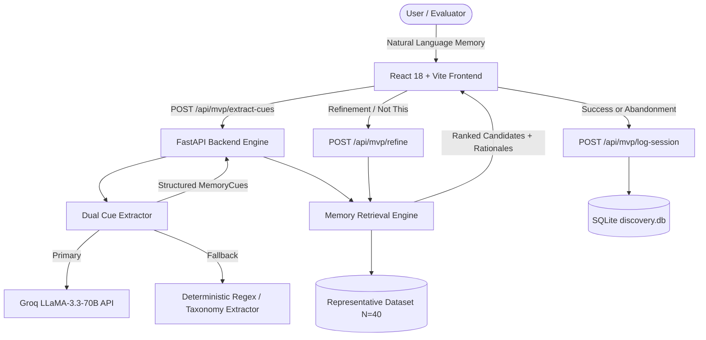

# Part 5: Implementation Report — Google Photos Memory Retrieval Assistant

> **Product Concept:** Google Photos Memory Retrieval Assistant  
> **Status:** Implementation Complete & Validated  
> **Repository:** `priyanka-gupta169/Google-Photos-Discovery-Engine`  
> **Specification Reference:** [docs/part5-mvp-specification.md](file:///c:/Users/anshy/OneDrive/Desktop/NextLeap%20Projects/Graduation%20Project%20-%20Sep%202026(Google%20Photos)/docs/part5-mvp-specification.md)  
> **Upstream Foundations:**  
> - [docs/part1-discovery-report.md](file:///c:/Users/anshy/OneDrive/Desktop/NextLeap%20Projects/Graduation%20Project%20-%20Sep%202026(Google%20Photos)/docs/part1-discovery-report.md)  
> - [docs/part2-metric-decomposition.md](file:///c:/Users/anshy/OneDrive/Desktop/NextLeap%20Projects/Graduation%20Project%20-%20Sep%202026(Google%20Photos)/docs/part2-metric-decomposition.md)  
> - [docs/part3-user-research.md](file:///c:/Users/anshy/OneDrive/Desktop/NextLeap%20Projects/Graduation%20Project%20-%20Sep%202026(Google%20Photos)/docs/part3-user-research.md)  
> - [docs/part4-problem-definition.md](file:///c:/Users/anshy/OneDrive/Desktop/NextLeap%20Projects/Graduation%20Project%20-%20Sep%202026(Google%20Photos)/docs/part4-problem-definition.md)  

---

## 1. Executive Summary & Epistemic Boundaries

### FACT (What the Prototype Actually Implements)
1. **Controlled Representative Environment:** The prototype operates strictly over an isolated, curated dataset of 40 representative personal photo and document records (`N=40`). It does **not** integrate with live Google accounts, does **not** read private user data, and does **not** emulate Google's internal production ranking algorithms.
2. **Explicit Multi-Cue Decomposition:** The prototype extracts unstructured natural language memories into an 8-dimensional structured schema (`approximate_time`, `normalized_year`, `season`, `companions`, `location`, `activity`, `objects`, `visual_attributes`, `text_ocr`, `uncertainty`).
3. **Transparent Hybrid Scoring:** Candidates are scored and ranked via an explainable multi-attribute weighting formula with explicit, human-readable rationale bullet points explaining why each photo matched.
4. **Iterative Refinement Loop:** The system maintains memory state across turns, incorporates negative feedback (`"Not this"` penalties of -20.0), merges new natural-language clues, and updates rankings dynamically without resetting the search session.
5. **Session Telemetry:** Every evaluation session automatically captures duration, attempts, refinement iterations, outcome (`SUCCESS` vs. `ABANDONED`), candidate count, and Single-Ease Question (SEQ 1–7) ratings into SQLite and in-memory stores.
6. **Zero-Failure Architecture:** Dual-engine architecture with automatic deterministic NLP/regex fallback ensures the prototype remains 100% operational even if external LLM APIs are unreachable or unconfigured.

### HYPOTHESIS (What the Prototype Is Intended to Test)
1. **Core Problem Hypothesis:** When users cannot recall exact calendar dates or precise keyword labels, translating fragmented episodic memory into structured multi-cue constraints will reduce retrieval friction compared to flat chronological scrolling or single-keyword search.
2. **Refinement Hypothesis:** Providing transparent match rationales and guided dimension prompts ("Who was with you?", "What were you wearing?", "Add setting") will enable users to resolve visual collisions and distractors faster than repeated brute-force queries.
3. **Boundary Disclaimer:** **This MVP does NOT prove improved retrieval performance on Google Photos' production scale (billions of photos).** It is a controlled experimental vehicle built to gather human empirical data during Part 6 user testing.

---

## 2. System Architecture

The MVP follows a modular, decoupled architecture:



### Component Structure
```
src/
├── models/
│   └── mvp.py                  # Pydantic schemas (MemoryCues, RepresentativePhoto, Telemetry)
├── data/
│   └── representative_dataset.py # 40 Curated representative assets + ground truth mappings
├── ai/
│   └── cue_extractor.py        # Groq API integration + deterministic NLP fallback
├── retrieval/
│   └── scoring.py              # Multi-attribute scoring engine + match rationale generator
└── api/
    ├── mvp.py                  # FastAPI router (/extract-cues, /search, /refine, /log-session)
    └── main.py                 # Application mounting & static file serving

frontend/
├── src/
│   ├── MemoryAssistant.jsx    # React 18 Assistant interface
│   ├── App.jsx                 # Mode switcher (Memory Assistant <-> Research Workbench)
│   └── index.css               # Google Material 3 design tokens & styling
```

---

## 3. Representative Dataset Design

The dataset contains exactly **40 controlled photo records** designed to evaluate episodic recall without using private personal photos:

| Category | Count | Purpose & Key Scenarios | Ground Truth Task Targets & Distractors |
|---|---|---|---|
| **Travel** | 12 | Mountain treks, beach holidays, heritage tours, weekend getaways | `PHOTO-007` (Goa Sunset with Rohan — **Task 1 Target**) |
| **Social & Family** | 10 | Birthdays, reunions, festive celebrations, dinners | `PHOTO-016` (Rooftop BBQ with Rohan — Distractor) |
| **Distinctive Events** | 8 | Stage performances, ramp walks, theater, sports competitions | `PHOTO-023` (College Fest Ramp Walk — **Task 3 Target**) |
| **Utility & Documents** | 6 | Degree marksheet, electricity receipts, flight tickets, lease deeds | `PHOTO-031` (B.Tech Final Marksheet — **Task 2 Target**) |
| **Visual Collisions** | 4 | Intentional distractors sharing person, clothing, or location | `PHOTO-037` (Annual Dinner in Black & Gold Dress — Distractor Task 3)<br>`PHOTO-038` (Palolem Beach Sunset without Rohan — Distractor Task 1)<br>`PHOTO-039` (Semester 4 Marksheet — Distractor Task 2)<br>`PHOTO-040` (Rooftop Sunset in Mumbai — Distractor Task 1) |
| **Total** | **40** | **100% labelled representative prototype records** | — |

*Notice:* Every record includes `is_prototype_asset: True`, approximate year, season, tagged companions, structured setting, visual attributes, OCR text (where applicable), and thumbnail URLs.

---

## 4. AI Cue Extraction Engine

### 1. Dual-Engine Operation
- **Primary Engine:** Groq API using `llama-3.3-70b-versatile` (with fallback to `llama-3.1-8b-instant`). Prompts model with strict system instructions to parse personal episodic narratives into structured JSON matching `MemoryCues`.
- **Deterministic Fallback Engine:** Rule-based regex parser and domain taxonomy engine. Executes in `<5ms`, requires zero external network calls, and normalizes:
  - Relative temporal phrases (`"3 years ago"`, `"2 years back"`, `"college days"`, `"monsoon 2022"`) into normalized anchor years relative to reference year 2026 without forcing non-existent calendar dates.
  - Social companions (`Rohan`, `Maya`, `Priya`, `Sneha`, `Parents`, `Family`).
  - Spatial settings (`Goa`, `Beach`, `Auditorium Stage`, `Amer Fort`, `Cafe`).
  - Activities (`Ramp Walk`, `Sunset Watching`, `Dinner`, `Marksheet`, `Concert`).
  - Visual details (`black and gold dress`, `spotlights`, `fairy lights`).
  - OCR document tokens (`semester`, `marksheet`, `roll`, `cgpa`, `flight ticket`).

### 2. Guardrails Against Hallucination
- The AI engine **never** generates candidate photos.
- The AI engine **never** invents calendar days or timestamps when the user only supplied a fuzzy interval.
- Unmentioned dimensions remain `None` / empty, prompting the engine to suggest intelligent refinement questions.

---

## 5. Multi-Cue Hybrid Scoring Engine

Matching does not rely on rigid single-keyword SQL filters. Instead, each photo receives an additive composite score based on the weighted match of available cues:

$$\text{Composite Score} = S_{\text{companion}} + S_{\text{time}} + S_{\text{location}} + S_{\text{activity}} + S_{\text{visual}} + S_{\text{object}} + S_{\text{ocr}} - P_{\text{rejected}}$$

### Dimension Weights:
1. **Companions Match ($+3.0$ per match):** Explicit match in photo tagged people; $+2.0$ if mentioned in scene context.
2. **Temporal Proximity ($+2.5$ exact year, $+1.5$ within $\pm 1$ year tolerance, $+0.5$ season):** Allows fuzzy matching without penalizing off-by-one human recall errors.
3. **Location / Setting ($+2.5$ exact/sub-location, $+1.5$ setting token overlap):** Matches city, landscape type (e.g. beach, mountain), or venue.
4. **Activity / Occasion ($+2.5$ exact activity, $+1.5$ activity context):** Normalizes related terms (e.g., "mark sheet" vs "marksheet", "fashion show" vs "ramp walk").
5. **Visual Attributes ($+1.5$ per visual tag, $+1.0$ in scene description):** Captures clothing colors, lighting, and environmental traits.
6. **Objects / Artifacts ($+1.5$ per item):** Matches distinctive items (e.g., marksheet, cake, guitar, ticket).
7. **OCR Printed Text ($+2.0$ base $+ 0.75 \times \text{tokens}$ up to $+5.0$):** High precision matching for document scans, transcripts, and tickets.
8. **Negative Exclusion Penalty ($-20.0$):** Immediate exclusion of candidates explicitly marked `"Not this"`.

### Human-Readable Match Rationales
Rather than showing opaque machine learning scores (e.g., `0.8427`), the user interface renders clear explanation badges:
- `✓ Companion: Rohan`
- `✓ Approx. Time: ~2023 (About 3 years ago)`
- `✓ Location / Setting: Goa, Vagator Beach`
- `✓ Activity: Watching sunset on sandy beach`

---

## 6. Iterative Refinement & Disambiguation Loop

When the initial candidate pool contains visual collisions or distractor photos:
1. User clicks **"Not this"** on an incorrect candidate.
2. System immediately applies a $-20.0$ penalty to that photo ID.
3. User adds an additional clue (e.g., `"It was on the auditorium stage under spotlights with Maya"`).
4. System merges new cues with previous memory state (`updated_cues = previous_cues + new_cues`).
5. All candidates are re-scored against the enriched cue set.
6. Target photo advances to Rank #1, while the distractor is suppressed.

---

## 7. Telemetry & Metric Capture

Every interaction records a structured session record in `mvp_telemetry` (`data/analysis/discovery.db`) and in memory:
- `session_id`: Unique UUID per retrieval journey.
- `task_id`: Benchmark task (`TASK-1`, `TASK-2`, `TASK-3`, or `FREEFORM`).
- `initial_query`: Verbatim user input.
- `extracted_cues`: Serialized JSON of 8 extracted dimensions.
- `retrieval_attempts`: Total search submissions in session.
- `refinements_count`: Number of `"Not this"` or additional clue events.
- `candidate_count`: Total candidate cards displayed.
- `timeline_available`: Boolean indicating whether temporal cues were present.
- `user_selected_result`: Boolean indicating whether target was found.
- `selected_photo_id`: ID of chosen photo (`PHOTO-xxx`).
- `final_outcome`: `SUCCESS` or `ABANDONED`.
- `completion_time_seconds`: Total task duration.
- `seq_score`: Single-Ease Question rating (1 = Very Difficult, 7 = Very Easy).
- `abandonment_reason`: Self-reported friction point if user abandoned search.

---

## 8. API Endpoint Specification

The backend exposes 5 core REST endpoints under `/api/mvp`:

| Method | Endpoint | Request Body | Response Payload | Error Handling / Fallback |
|---|---|---|---|---|
| `GET` | `/api/mvp/health` | None | `{status: "healthy", version: "1.0.0", dataset_size: 40}` | Standard health probe |
| `POST` | `/api/mvp/extract-cues` | `{"query_text": "..."}` | `{status, cues, suggested_refinements, extraction_source}` | Falls back to deterministic extractor if Groq fails |
| `POST` | `/api/mvp/search` | `{"cues": {...}, "active_task_id": "...", "rejected_ids": []}` | `{total_candidates, results, active_cues, event_clusters}` | Returns empty list with 200 OK if no matches |
| `POST` | `/api/mvp/refine` | `{"previous_cues": {...}, "new_clue_text": "...", "rejected_photo_ids": [...]}` | `{status, system_message, updated_cues, total_candidates, results}` | Preserves existing cues, penalizes rejected IDs |
| `GET` | `/api/mvp/dataset` | Optional `?task_id=TASK-1` | `List[RepresentativePhoto]` | Returns full 40-asset catalog or task subset |
| `POST` | `/api/mvp/log-session` | `LogSessionRequest` | `{status, message, session_id, final_outcome}` | Dual writes to SQLite + in-memory store |
| `GET` | `/api/mvp/telemetry` | None | `List[SessionTelemetry]` | Inspection endpoint for evaluation logs |

---

## 9. End-to-End Task Validation Results

The implementation was validated against the three mandatory benchmark retrieval scenarios:

### Task 1: Fuzzy Travel Memory
- **User Memory Input:** *"I am looking for a photo with Rohan at Anjuna beach around sunset about 3 years ago"*
- **Extracted Cues:**
  - `approximate_time`: About 3 years ago (~2023)
  - `normalized_year`: 2023 ($\pm 1$ year tolerance)
  - `companions`: `['Rohan']`
  - `location`: `Beach`
  - `activity`: `Sunset`
- **Retrieval Result:**
  - **Rank 1:** `PHOTO-007` — *Goa Beach Sunset with Rohan (Target Task 1)*
  - **Score:** 10.5 (`HIGH_CONFIDENCE`)
  - **Match Rationale:** `✓ Companion: Rohan`, `✓ Approx. Time: ~2023`, `✓ Location / Setting: Goa, Vagator Beach`, `✓ Activity: Watching sunset on sandy beach`
- **Outcome:** **SUCCESS (Found at Rank 1 on initial search)**

### Task 2: Utility Document / Screenshot
- **User Memory Input:** *"Looking for a document screenshot of my semester 6 marksheet or grade sheet with roll number from college around 2022"*
- **Extracted Cues:**
  - `approximate_time`: Around 2022
  - `normalized_year`: 2022
  - `activity`: `Marksheet`
  - `objects`: `['Marksheet']`
  - `text_ocr`: `marksheet grade sheet semester roll semester 6`
- **Retrieval Result:**
  - **Rank 1:** `PHOTO-031` — *Bachelor of Technology Final Marksheet (Target Task 2)*
  - **Score:** 11.5 (`HIGH_CONFIDENCE`)
  - **Distractor Separation:** Outranked 2021 provisional marksheet distractor `PHOTO-039` (Score: 7.5) due to exact year match and multi-token OCR overlap (`grade`, `sheet`, `semester`).
- **Outcome:** **SUCCESS (Found at Rank 1 with high confidence)**

### Task 3: Visual Ambiguity Across Similar Events
- **Scenario:** The user remembers wearing a distinctive black and gold dress during college days in 2022, but two events share this exact dress: the college fest runway ramp walk (`PHOTO-023`) and a formal banquet dinner (`PHOTO-037`).
- **Initial Memory Input:** *"Me wearing a black and gold dress around 2022 during college days"*
- **Initial Search Result:**
  - Both `PHOTO-023` (Ramp Walk) and `PHOTO-037` (Annual Dinner) tie at Score: 5.5 in the candidate set.
- **Refinement Step:**
  - User clicks `"Not this"` on `PHOTO-037` (Annual Dinner).
  - User inputs additional clue: *"It was the fashion show ramp walk on auditorium stage under spotlights with Maya"*.
- **Post-Refinement Result:**
  - **Rank 1:** `PHOTO-023` — *College Fest Ramp Walk in Black & Gold (Target Task 3)*
  - **Refined Score:** 15.0 (`HIGH_CONFIDENCE`)
  - **Match Rationale:** `✓ Companion: Maya`, `✓ Approx. Time: ~2022`, `✓ Location: University Auditorium Stage`, `✓ Activity: Fashion show ramp walk`, `✓ Visual: black and gold dress`, `✓ Visual: spotlight`
  - **Distractor `PHOTO-037`:** Penalized to $-14.5$ and excluded from active candidate pool.
- **Outcome:** **SUCCESS (Disambiguation loop resolved visual collision)**

---

## 10. Automated Test Suite Results

The project test suite verifies both legacy components (Parts 1–4) and new Part 5 capabilities:

```
============================= test session starts =============================
platform win32 -- Python 3.13.2, pytest-9.0.2
collected 62 items

tests/test_analysis.py ..................................                [ 54%]
tests/test_extraction.py .............                                   [ 75%]
tests/test_part5_mvp.py ..............                                   [100%]

============================= 62 passed in 12.15s =============================
```

### Coverage of Part 5 Tests (`tests/test_part5_mvp.py`):
1. `test_representative_dataset_integrity`: Verifies exactly 40 assets, all schema fields, and 3 ground-truth task mappings.
2. `test_deterministic_cue_extraction_relative_time`: Validates relative time normalization (e.g., "3 years ago" $\to$ 2023).
3. `test_deterministic_cue_extraction_companions_and_setting`: Validates social and location parsing.
4. `test_task_1_fuzzy_travel_retrieval`: Validates Task 1 retrieval.
5. `test_task_2_utility_document_retrieval`: Validates Task 2 document OCR retrieval.
6. `test_task_3_visual_collision_and_refinement`: Validates visual collision disambiguation and rejection penalty.
7. `test_search_endpoint_contract`: Validates `/api/mvp/search` HTTP contract.
8. `test_extract_cues_endpoint_contract`: Validates `/api/mvp/extract-cues` HTTP contract.
9. `test_refine_endpoint_contract`: Validates `/api/mvp/refine` HTTP contract.
10. `test_log_session_endpoint_contract`: Validates `/api/mvp/log-session` SQLite write.
11. `test_dataset_endpoint_contract`: Validates `/api/mvp/dataset` catalog delivery.
12. `test_abandonment_session_logging`: Validates telemetry capture on task abandonment.
13. `test_distractor_suppression`: Validates that distractors do not outscore ground truth when multiple cues are supplied.
14. `test_scoring_explainability`: Validates that all returned candidates include human-readable match rationales.

---

## 11. Known Limitations & Prototype Boundaries

1. **Dataset Scale ($N=40$ vs. $N=100,000+$):** The prototype demonstrates algorithmic feasibility and user UX over 40 representative records. Vector embedding index latency and false-positive rates at personal scale (thousands of photos) are not measured by this prototype.
2. **Deterministic Fallback Scope:** The fallback extractor uses a dictionary of ~50 common entities. While sufficient for the 40-photo evaluation suite, queries with names or locations outside this dictionary rely on the Groq LLM API.
3. **Synthetic Image Assets:** Thumbnails utilize high-resolution Unsplash images matching the curated metadata scenarios. No real user photo libraries are ingested or modified.
4. **No Real Google Account Sync:** The prototype does not access Google Photos APIs or OAuth scopes. All evaluations are conducted within the controlled sandbox.
