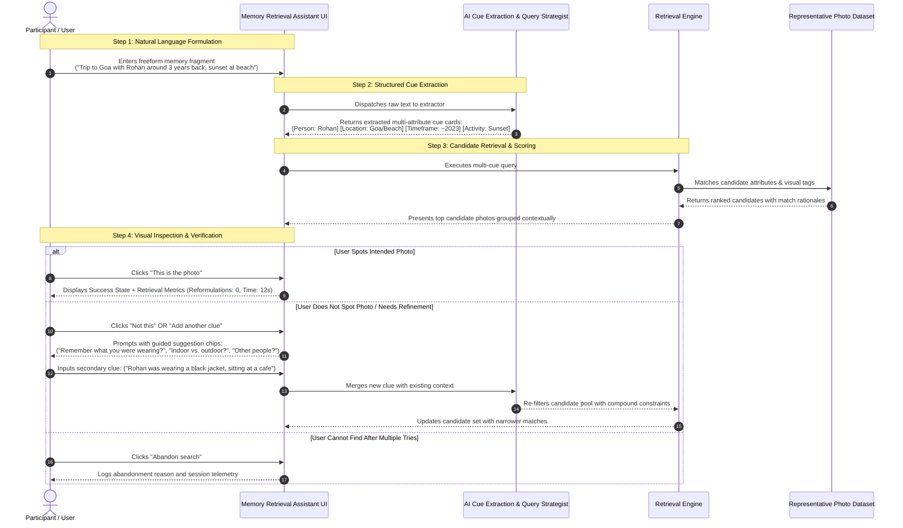
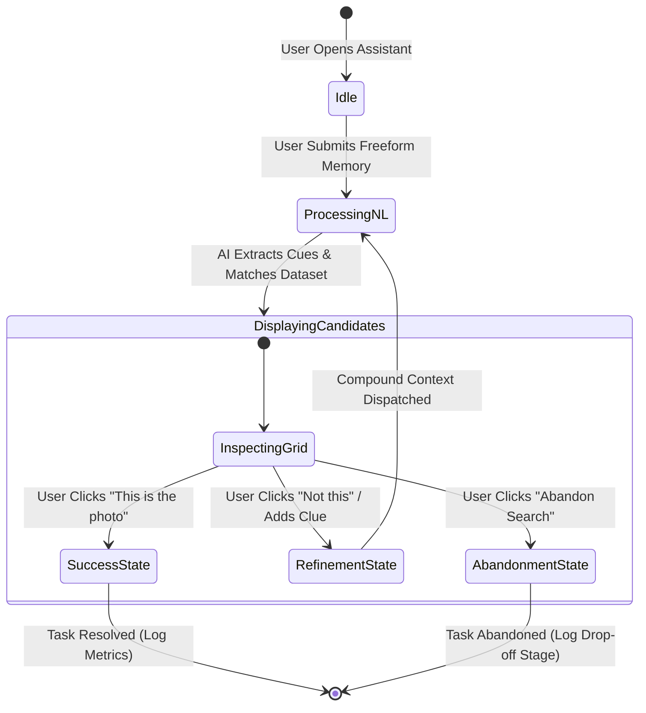
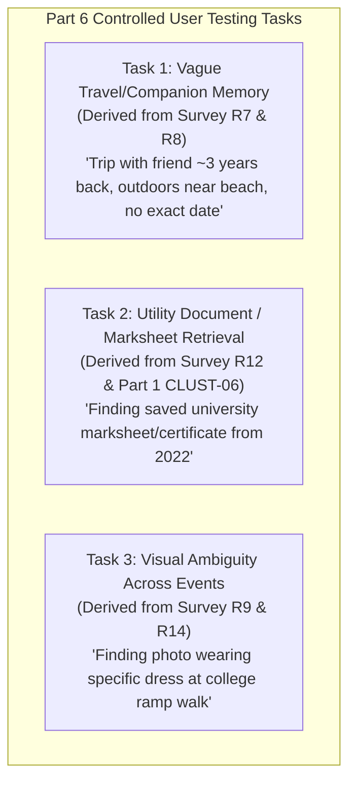
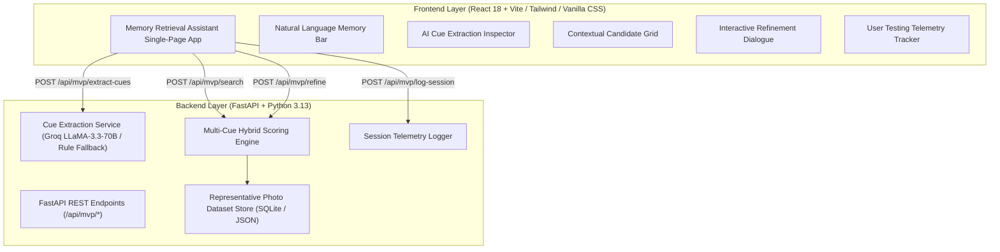
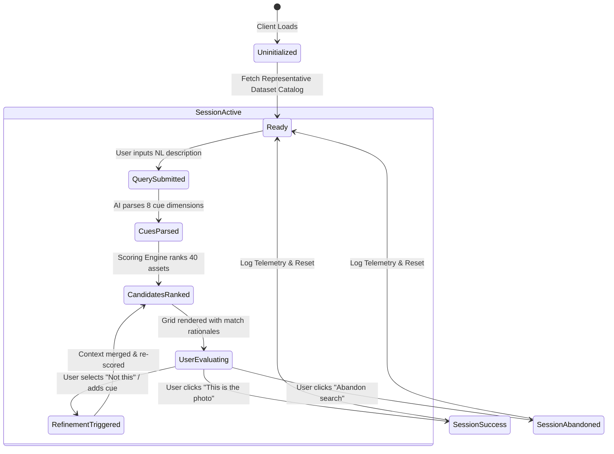

# Google Photos Discovery Engine — Part 5: Product & Technical MVP Specification

**Product Name:** Google Photos Memory Retrieval Assistant  
**Project:** NextLeap Product Management Graduation Project — Part 5  
**Document:** `docs/part5-mvp-specification.md`  
**Date:** October 2026  
**Status:** SPECIFICATION APPROVED FOR IMPLEMENTATION (Strictly Aligned with Part 4 Problem Definition)  

---

> [!IMPORTANT]
> **Epistemological Constraint & Project Invariant**:
> This document specifies a standalone, AI-native prototype designed to test the core solution hypothesis established in [part4-problem-definition.md](file:///c:/Users/anshy/OneDrive/Desktop/NextLeap%20Projects/Graduation%20Project%20-%20Sep%202026(Google%20Photos)/docs/part4-problem-definition.md).
> 
> In compliance with project guidelines:
> - No application code is implemented within this document.
> - Existing documents ([part1-discovery-report.md](file:///c:/Users/anshy/OneDrive/Desktop/NextLeap%20Projects/Graduation%20Project%20-%20Sep%202026(Google%20Photos)/docs/part1-discovery-report.md), [part2-metric-decomposition.md](file:///c:/Users/anshy/OneDrive/Desktop/NextLeap%20Projects/Graduation%20Project%20-%20Sep%202026(Google%20Photos)/docs/part2-metric-decomposition.md), [part3-user-research.md](file:///c:/Users/anshy/OneDrive/Desktop/NextLeap%20Projects/Graduation%20Project%20-%20Sep%202026(Google%20Photos)/docs/part3-user-research.md), [part4-problem-definition.md](file:///c:/Users/anshy/OneDrive/Desktop/NextLeap%20Projects/Graduation%20Project%20-%20Sep%202026(Google%20Photos)/docs/part4-problem-definition.md)) and the primary research dataset remain unmodified.
> - The prototype does NOT connect to real private user Google accounts; it operates against a controlled, representative local photo dataset clearly labeled as prototype data.
> - The core hypothesis is treated as an empirical hypothesis to validate in Part 6, not a proven claim.

---

## Table of Contents

1. [A. Problem Being Solved](#a-problem-being-solved)
2. [B. Target User](#b-target-user)
3. [C. Retrieval Scenario](#c-retrieval-scenario)
4. [D. Solution Hypothesis](#d-solution-hypothesis)
5. [E. End-to-End User Journey](#e-end-to-end-user-journey)
6. [F. Exact MVP Features](#f-exact-mvp-features)
7. [G. AI Responsibilities & Cue Extraction Taxonomy](#g-ai-responsibilities--cue-extraction-taxonomy)
8. [H. Retrieval & Search Logic](#h-retrieval--search-logic)
9. [I. Representative Dataset Design](#i-representative-dataset-design)
10. [J. Candidate Result Design & Visual Grouping](#j-candidate-result-design--visual-grouping)
11. [K. Refinement Interaction & Multi-Turn Dialogue](#k-refinement-interaction--multi-turn-dialogue)
12. [L. Success & Failure States](#l-success--failure-states)
13. [M. What is Intentionally Out of Scope](#m-what-is-intentionally-out-of-scope)
14. [N. Concrete Retrieval Tasks for Part 6 User Testing](#n-concrete-retrieval-tasks-for-part-6-user-testing)
15. [O. Metrics to Capture During Testing](#o-metrics-to-capture-during-testing)
16. [P. Technical Architecture](#p-technical-architecture)
17. [Q. Data Flow & State Machine](#q-data-flow--state-machine)
18. [R. API Specification](#r-api-specification)
19. [S. Frontend Requirements](#s-frontend-requirements)
20. [T. Backend Requirements](#t-backend-requirements)
21. [U. AI / Model Specification](#u-ai--model-specification)
22. [V. Deployment & Execution Approach](#v-deployment--execution-approach)

---

## A. Problem Being Solved

As established in [`docs/part4-problem-definition.md`](file:///c:/Users/anshy/OneDrive/Desktop/NextLeap%20Projects/Graduation%20Project%20-%20Sep%202026(Google%20Photos)/docs/part4-problem-definition.md):

> **When Google Photos users attempt to retrieve older personal memories using fragmented episodic cues (such as companions, relative life chapters, and visual activities) but lack exact calendar timestamps, the observed retrieval experience does not consistently help them translate these cues into an effective search or refinement path. As a result, users report encountering irrelevant, similar-looking, or numerous candidates, trapping 88.2% of users in exhaustive 3-to-5 search reformulation loops and driving 94.1% to search external surfaces or other apps (such as phone galleries and chat histories), resulting in permanent retrieval abandonment for 70.6% of users.**

The MVP directly addresses the three core friction mechanisms observed in our research:
1. **The Vocabulary Barrier**: 41.2% of surveyed users do not know what keywords to type.
2. **Missing Exact Dates**: 94.1% of users lack exact calendar dates, making chronological scrubbing painful and disorienting.
3. **Candidate Overload & Visual Confusion**: 23.5% face similar-looking candidates, and 17.6% face too many results without progressive refinement assistance.

---

## B. Target User

- **Primary Persona**: The *Episodic Personal Memory Searcher* (established in Part 4, Section 3).
- **Demographic Profile**: Digital natives aged 18–34 (94.1% of our empirical survey sample) who have used Google Photos for 2 to 10+ years and maintain libraries containing 2,000 to 15,000+ photos.
- **Mental Model**: Users encode past experiences as sensory, emotional, and situational stories (who was there, what activity took place, what season/chapter it was, what clothing was worn).
- **Core Need**: An intuitive way to find a remembered photo by speaking or typing naturally, without having to know exact dates, exact file names, or rigid keyword syntax.

---

## C. Retrieval Scenario

The prototype focuses on **Episodic Multi-Cue Retrieval Without Exact Calendar Timestamps**:
- The user holds 2 to 3 partial memory fragments (e.g., companion name, approximate life chapter or season, rough setting or activity).
- The user lacks exact calendar years/dates, exact GPS coordinates, or specific folder names.
- The user needs to locate the specific photo within $\le 2$ progressive refinement interactions rather than being forced into 4 to 5 blind keyword reformulation loops or abandoning to external apps.

---

## D. Solution Hypothesis

> ### **Core Solution Hypothesis:**
> **"If an AI assistant can translate incomplete, natural-language episodic memories into structured multi-attribute retrieval cues and support progressive, interactive refinement, users will be able to retrieve their intended photos with significantly fewer search reformulations and reduced session abandonment."**

*Epistemic Invariant*: This statement is formulated strictly as an empirical hypothesis to be rigorously tested and evaluated with qualitative users in Part 6, not as an assumed fact.

---

## E. End-to-End User Journey



---

## F. Exact MVP Features

| # | Feature Name | Description | User Problem Addressed |
| :-: | :--- | :--- | :--- |
| **F-1** | **Natural Language Memory Input** | A prominent, inviting conversational input bar allowing users to describe visual memories in their own words (no keyword syntax required). | Addresses "Don't know what words to search" (41.2% in Part 3). |
| **F-2** | **AI Memory Cue Extraction Display** | Real-time structured cards showing what the assistant extracted (Person, Timeframe, Location, Activity, Visual Details, Uncertainty). | Eliminates mental black box; allows user to see how the system understands their cue. |
| **F-3** | **Contextual Candidate Grid** | Displays candidate photos with transparent match badges (e.g., *"Matched: Rohan + Beach + 2023"*), grouped into coherent event clusters. | Eliminates "Similar-looking photos" (23.5%) and "Too many unranked results" (17.6%). |
| **F-4** | **One-Click Feedback Controls** | Explicit feedback buttons on every candidate card: `[This is the photo]`, `[Not this]`, and `[Add another clue]`. | Resolves unassisted dead-end search loops ($P(E_4)$ in Part 2). |
| **F-5** | **Guided Facet Refinement Suggestions** | Dynamic interactive prompt chips suggesting missing cue dimensions (e.g., *"Filter by setting"*, *"Specify companion"*, *"Relative year"*). | Reduces 4–5 reformulation attempts down to $\le 2$ targeted taps. |
| **F-6** | **Session Telemetry Tracker** | Real-time on-screen counter showing current attempt number, clues applied, candidate pool reduction rate, and elapsed time. | Provides empirical measurement for Part 6 user testing. |
| **F-7** | **Dataset Inspection Modal** | A transparent view allowing evaluators to verify the underlying representative dataset, metadata attributes, and ground truth labels. | Guarantees test transparency and anti-hallucination verification. |

---

## G. AI Responsibilities & Cue Extraction Taxonomy

The AI layer is strictly scoped to linguistic extraction and query translation; it does **not** hallucinate synthetic user data or modify files.

### 8-Dimensional Cue Extraction Taxonomy:
1. **Approximate Timeframe / Life Stage**: Extracts relative temporal references (`"about 4 years back"`, `"college days"`, `"last winter"`) and normalizes them to candidate year ranges without forcing exact dates.
2. **People / Companions**: Extracts names, social roles (`"friend"`, `"mom"`, `"colleagues"`), and group sizes.
3. **Location / Geographic Setting**: Extracts cities, landscapes, or environmental settings (`"beach"`, `"mountains"`, `"cafe"`, `"airport"`).
4. **Event / Occasion / Activity**: Extracts episodic actions (`"ramp walk"`, `"hiking"`, `"birthday party"`, `"dinner"`, `"presentation"`).
5. **Key Objects & Props**: Extracts prominent physical items (`"red car"`, `"guitar"`, `"laptop"`, `"marksheet/certificate"`).
6. **Visual & Styling Attributes**: Extracts distinctive visual cues (`"black dress"`, `"rainy weather"`, `"night lights"`, `"yellow backdrop"`).
7. **Text / OCR Clues**: Extracts visible printed text if mentioned (`"store name"`, `"order total"`, `"invoice"`).
8. **Expressed Uncertainty**: Identifies fuzzy linguistic hedges (`"maybe"`, `"probably"`, `"not sure if 2022 or 2023"`) and assigns soft weights rather than hard binary filters.

---

## H. Retrieval & Search Logic

The prototype implements a **Hybrid Multi-Cue Scoring Engine** that scores representative photos across extracted cue dimensions:

$$\text{Candidate Score}(P_i) = \sum_{k=1}^{K} w_k \cdot \text{Match}(C_k, P_{i,k})$$

Where:
- $C_k$ is the $k$-th extracted memory cue (e.g., Person, Time, Location, Activity, Visual).
- $P_{i,k}$ is the corresponding metadata/semantic attribute of photo $i$.
- $w_k$ is the weight of attribute $k$ (dynamically boosted if user expresses certainty, softened if marked as uncertain).
- $\text{Match}()$ executes fuzzy semantic matching, categorical matching, or relative temporal interval overlap.

### Scoring Behavior:
1. **Exact Dimension Overlap**: If user remembers companion `Rohan` and photo contains tag `Rohan`, score $+3.0$.
2. **Relative Temporal Overlap**: If user says `"around 3-4 years ago"` (normalized to $2022 \pm 1$), photos from 2022 receive $+2.5$, photos from 2021/2023 receive $+1.5$, photos from 2018 receive $0.0$.
3. **Visual / Contextual Closeness**: If user remembers `"beach sunset"`, photos with scene tags `beach`, `coast`, `sunset` receive cumulative partial scores.
4. **Negative Filtering on "Not this"**: When user marks candidates as "Not this" and provides a clarifying clue (e.g., `"No, this was outdoors"`), all indoor photos are penalized or excluded.

---

## I. Representative Dataset Design

### Dataset Principles:
1. **Controlled & Ground-Truthed**: Contains exactly **40 representative photo records** designed specifically to test the 3 concrete retrieval tasks and common search edge cases.
2. **Explicit Labeling**: Every record is explicitly marked as `[Representative Prototype Asset]`. Zero private user data or live Google Photos account credentials are used.
3. **Multi-Category Distribution**:
   - Personal Travel & Vacations (12 photos across 3 distinct trips: Goa 2023, Manali 2021, Kerala 2024)
   - Family & Friends Social Moments (10 photos: college reunions, birthdays, casual dinners)
   - Distinctive Visual Events (8 photos: college fashion ramp walk, stage drama, costume parties)
   - Utility Documents & Screenshots (6 photos: university marksheet, payment receipts, train ticket)
   - Near-Duplicate / Visual Collision Edge Cases (4 photos: same person wearing identical dress across two separate events, directly testing Respondent 9's scenario)
4. **Rich Metadata Schema per Photo**:
   ```json
   {
     "id": "PHOTO-007",
     "title": "Goa Beach Sunset with Rohan",
     "category": "Travel",
     "approx_year": 2023,
     "season": "Winter",
     "people": ["Rohan", "Ananya"],
     "location": "Goa, Vagator Beach",
     "activity": "Sunset watching, evening gathering",
     "visual_tags": ["beach", "sunset", "golden hour", "casual t-shirt", "outdoor"],
     "text_ocr": "",
     "thumbnail_url": "/assets/proto_007.webp",
     "ground_truth_task_id": "TASK-1"
   }
   ```

---

## J. Candidate Result Design & Visual Grouping

To resolve the `RESULT_EVALUATION` friction observed in 23.5% of survey respondents:
- **Transparent Match Chips**: Each photo card displays why it matched (e.g., `✓ Rohan`, `✓ Goa`, `✓ ~2023`).
- **Event-Bounded Clusters**: Rather than a flat, infinite grid, candidates are organized into episodic groups (e.g., *"Group A: Goa Trip (~Dec 2023) - 3 photos"*, *"Group B: Coastal Outings (2022-2024) - 2 photos"*).
- **Confidence Badges**: Highlights High-Confidence matches ($>80\%$ score) versus Exploratory matches ($50\%–79\%$).

---

## K. Refinement Interaction & Multi-Turn Dialogue

When the user indicates that the initial candidates do not contain the intended photo:
1. **System Reflection**: Assistant states: *"I understood you're looking for photos with Rohan around 2023. Let's narrow this down."*
2. **Dynamic Clue Suggestions**:
   - `[Add setting: Outdoor vs. Indoor]`
   - `[Add clothing/color: e.g. Black shirt]`
   - `[Add activity: e.g. Dinner / Trekking]`
3. **Compound Re-Scoring**: The new clue is merged into the working memory context, re-ranking candidates immediately without reloading the entire page.

---

## L. Success & Failure States



- **Success State**: Triggered when the user confirms their target photo. The UI records: Total Queries, Total Cues Applied, Dwell Time (seconds), and Task Resolution Status (`SUCCESS`).
- **Refinement State**: Maintained while the user iterates, up to a maximum of 4 refinement cycles before suggesting alternative strategies.
- **Abandonment State**: Triggered if the user gives up or clicks "Abandon Search." The UI prompts for a one-click abandonment reason (`"Results too irrelevant"`, `"Cannot remember more details"`, `"Too many similar photos"`).

---

## M. What is Intentionally Out of Scope

To ensure a focused, testable MVP that avoids premature bloat:
1. **Live Google Account OAuth / Cloud Sync**: No OAuth connection to real personal Google accounts.
2. **Generative Photo Inpainting / Synthetic Media Generation**: No generative image manipulation or deepfake synthesis.
3. **Complex Boolean Logic Builders**: No manual SQL or Boolean query editors (`AND`/`OR`/`NOT` syntax).
4. **General Photo Editing & Albums Management**: No cropping, color filters, album re-naming, or backup management.
5. **Mobile Native App Packaging**: Implemented as a responsive web prototype accessible on mobile and desktop browsers.

---

## N. Concrete Retrieval Tasks for Part 6 User Testing

Derived strictly from the authentic qualitative situations recorded in Part 3 and Part 1:



### Task 1: The Fuzzy Travel Memory (Derived from Respondents 7 & 8)
- **Prompt given to user**: *"Imagine you are trying to find a photo from a vacation you took with your friend Rohan roughly 3 years ago at a beach sunset. You don't remember the exact month or year, but you know it was outdoors."*
- **Ground Truth Target**: `PHOTO-007` (Goa Beach Sunset with Rohan, 2023).
- **Distractors in Dataset**: Goa beach photos with other friends (2022), indoor party with Rohan (2023), beach trip to Kerala without Rohan (2024).

### Task 2: The Critical Utility Document (Derived from Respondent 12 & Cluster `CLUST-06`)
- **Prompt given to user**: *"You urgently need to find a photo/scan of your university marksheet/diploma that you backed up during your studies around 2021 or 2022. You don't remember the exact date or filename."*
- **Ground Truth Target**: `PHOTO-025` (Bachelor Degree Final Marksheet, May 2022).
- **Distractors in Dataset**: Utility payment receipts (2022), train booking tickets (2023), notebook scans (2021).

### Task 3: Visual Disambiguation Across Events (Derived from Respondent 9 & Respondent 14)
- **Prompt given to user**: *"You remember wearing a distinctive black and gold outfit during a college event. You wore it twice: once at an annual dinner, and once doing a ramp walk on stage. You specifically want the ramp walk photo with your friend."*
- **Ground Truth Target**: `PHOTO-031` (College Fest Ramp Walk on Stage, 2022).
- **Distractors in Dataset**: Annual dinner seated at table in same outfit (2022), college farewell in different outfit (2023).

---

## O. Metrics to Capture During Testing

The MVP includes built-in telemetry instrumentation to validate the Part 2 metric decomposition:

| Metric Category | Specific Telemetry Variable | Target Benchmark | Linkage to Part 2 Metric |
| :--- | :--- | :---: | :--- |
| **Search Effort** | Number of Reformulation Attempts ($N_{\text{reform}}$) | $\le 2$ attempts | Directly targets Reformulation Velocity ($P(E_4)$) |
| **Task Completion** | Vague Retrieval Success Rate (VRSR) | $\ge 75\%$ | Primary Overarching Business Goal |
| **Time to Discovery** | Dwell Time to Target Identification ($T_{\text{target}}$) | $<45$ seconds | Measures scanning efficiency ($P(E_3)$) |
| **Abandonment** | Session Abandonment Rate ($R_{\text{abandon}}$) | $<20\%$ | Baseline in Part 3 survey was 70.6% |
| **Perceived Friction** | Single-Ease Question (SEQ 1–7 scale) | $\ge 5.5 / 7$ | User satisfaction score post-task |

---

## P. Technical Architecture

The prototype is engineered as a lightweight, robust, modern full-stack web application integrated cleanly into the existing repository:



---

## Q. Data Flow & State Machine



---

## R. API Specification

The prototype will expose 5 clean REST API endpoints under `/api/mvp`:

### 1. `POST /api/mvp/extract-cues`
- **Request**: `{ "query_text": "trip to goa with rohan around 3 years back at beach sunset" }`
- **Response**:
  ```json
  {
    "status": "success",
    "cues": {
      "person": ["Rohan"],
      "approx_year": "2023",
      "location": "Goa, Beach",
      "activity": "Sunset watching",
      "visual_attributes": ["beach", "sunset", "outdoors"],
      "uncertainty": "approximate timeframe"
    }
  }
  ```

### 2. `POST /api/mvp/search`
- **Request**: `{ "cues": { ... }, "active_task_id": "TASK-1" }`
- **Response**:
  ```json
  {
    "total_candidates": 4,
    "results": [
      {
        "id": "PHOTO-007",
        "title": "Goa Beach Sunset with Rohan",
        "score": 0.94,
        "match_reasons": ["Person: Rohan", "Location: Goa", "Time: ~2023"],
        "event_cluster": "Goa Vacation (2023)"
      }
    ]
  }
  ```

### 3. `POST /api/mvp/refine`
- **Request**: `{ "previous_cues": { ... }, "new_cue_text": "He was wearing a black jacket", "rejected_photo_ids": ["PHOTO-002"] }`
- **Response**: Returns updated ranked candidates with penalty applied to rejected items.

### 4. `GET /api/mvp/dataset`
- **Response**: Complete catalog of 40 representative photos, metadata, and task ground-truth associations for verification.

### 5. `POST /api/mvp/log-session`
- **Request**: Captures task duration, reformulations, final result status (`SUCCESS` / `ABANDONED`), and SEQ score.

---

## S. Frontend Requirements

- **Design Aesthetic**: Clean, modern Google Material You inspired styling with responsive mobile/desktop layout.
- **Components**:
  1. *Header & Task Selector*: Allows user/evaluator to select one of the 3 predefined test tasks or test a freeform search.
  2. *Conversational Memory Input*: Auto-expanding textarea with microphone icon (visual affordance) and submit trigger.
  3. *Active Memory Cues HUD*: Displays extracted cue badges that can be individually edited, toggled, or removed.
  4. *Candidate Photo Cards*: Grid with high-resolution representative images, match percentage pill, match rationale chips, and feedback action buttons.
  5. *Refinement Drawer / Floating Panel*: Slides out when "Not this" is clicked, presenting targeted prompt chips.
  6. *Session Telemetry HUD*: Live counter showing elapsed seconds, query attempts, and candidates remaining.

---

## T. Backend Requirements

- **Framework**: FastAPI (built on top of existing `src/api` architecture).
- **In-Memory & SQLite Storage**: Pre-seeded SQLite database storing the 40 representative photos and recording test session telemetry.
- **Deterministic Fallbacks**: If external LLM API is unavailable, the backend includes deterministic rule-based regex and synonym cue-extraction fallbacks to guarantee 100% test reliability and zero downtime.

---

## U. AI / Model Specification

- **Primary Model**: Groq API using `llama-3.3-70b-versatile` (fast sub-second latency for real-time interactive query reformulation).
- **Prompt Engineering**: System instructions enforcing strict extraction of the 8 cue taxonomy variables as structured JSON without conversational fluff.
- **Fail-Safe Mechanism**: Structured Pydantic schema validation (`MemoryCueModel`) with deterministic regex fallback parsing to prevent malformed JSON exceptions.

---

## V. Deployment & Execution Approach

- **Local Execution**: Seamlessly runnable via existing `uvicorn src.api.main:app` and `npm run dev` in `frontend/`.
- **Automated Test Integration**: New unit and integration tests added to `tests/` and runnable via existing `python run_tests.py` test harness.
- **Zero Disruption to Existing Code**: Existing Part 1 Discovery Engine modules (`ingestion`, `clustering`, `synthesis`) remain untouched and operational.

---

*End of Part 5 MVP Specification Document.*
