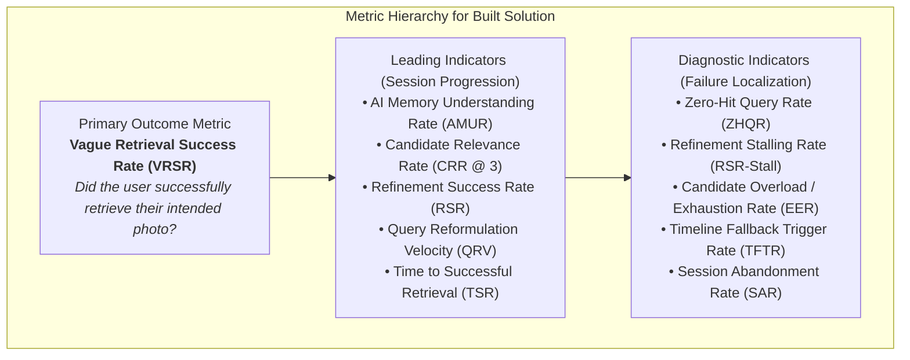
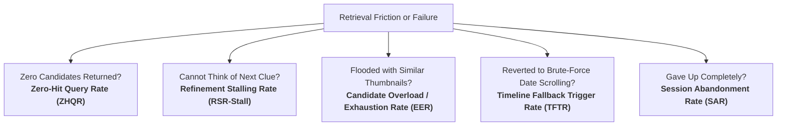
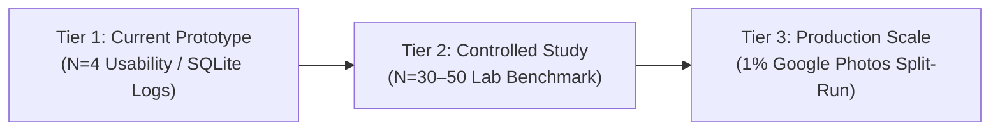

# Google Photos Discovery Engine — Part 7: Define Success: Metric Framework

**Project:** NextLeap Product Management Graduation Project — Part 7  
**Product:** Google Photos (Core Experience Team)  
**Solution:** Google Photos Memory Retrieval Assistant (AI-Native Multi-Cue Search & Progressive Refinement)  
**Document:** `docs/part7-success-metrics.md`  
**Date:** October 2026  
**Status:** COMPLETE & ALIGNED WITH BUILT MVP (Refined from Part 2 Decomposition, Grounded in Part 5 MVP and Part 6 Usability Signals)  
**Reference Implementations:**  
- Telemetry Models: [`src/models/mvp.py`](file:///c:/Users/anshy/OneDrive/Desktop/NextLeap%20Projects/Graduation%20Project%20-%20Sep%202026%28Google%20Photos%29/src/models/mvp.py)  
- Session Telemetry Database: [`src/api/mvp.py`](file:///c:/Users/anshy/OneDrive/Desktop/NextLeap%20Projects/Graduation%20Project%20-%20Sep%202026%28Google%20Photos%29/src/api/mvp.py)  
- Live Application: [https://app-photos-discovery-engine-fa3ckmfdn4mudlheyg2yxs.streamlit.app/](https://app-photos-discovery-engine-fa3ckmfdn4mudlheyg2yxs.streamlit.app/)  

---

> [!IMPORTANT]
> **Epistemological Constraint & Evidence Boundary**:
> - **Refinement, Not Reinvention**: This framework does **not** invent an arbitrary set of metrics. It directly reuses, adapts, and formalizes the metric concepts established in [`docs/part2-metric-decomposition.md`](file:///c:/Users/anshy/OneDrive/Desktop/NextLeap%20Projects/Graduation%20Project%20-%20Sep%202026%28Google%20Photos%29/docs/part2-metric-decomposition.md), adjusting them to reflect the actual solution built in Part 5 and evaluated in Part 6.
> - **Strict $N=4$ Usability Boundary**: All references to Part 6 user testing ($N=4$) represent **preliminary, directional usability signals**, not statistically significant production baselines. No production targets or SLA guarantees are asserted from $N=4$ data.
> - **Separation of Measurement Capabilities**: This document explicitly distinguishes between metrics computable in the current prototype environment, metrics measurable in a scaled lab evaluation, and metrics requiring production-scale Google Photos infrastructure.

---

## Table of Contents

1. [Part 7 Objective](#1-part-7-objective)
2. [Product Outcome Being Optimized](#2-product-outcome-being-optimized)
3. [Primary Success Metric](#3-primary-success-metric)
4. [Leading Metrics](#4-leading-metrics)
5. [Diagnostic Metrics](#5-diagnostic-metrics)
6. [Metric Definitions and Formulas](#6-metric-definitions-and-formulas)
7. [Mapping Metrics to the Retrieval Journey](#7-mapping-metrics-to-the-retrieval-journey)
8. [Relationship to the Part 2 Metric Framework](#8-relationship-to-the-part-2-metric-framework)
9. [How Part 6 User Testing Provides Preliminary Signals](#9-how-part-6-user-testing-provides-preliminary-signals)
10. [Diagnosing System Failure States](#10-diagnosing-system-failure-states)
11. [Measurement Plan for a Larger Evaluation](#11-measurement-plan-for-a-larger-evaluation)
12. [Metric Limitations and Caveats](#12-metric-limitations-and-caveats)
13. [Part 7 Conclusion](#13-part-7-conclusion)

---

## 1. Part 7 Objective

The objective of Part 7 is to define a decision-oriented **success, leading, and diagnostic metric framework** tailored specifically to the solution actually built: the **Google Photos Memory Retrieval Assistant**.

In Parts 1–4, we established that users searching for older personal photos struggle because human memory is episodic and fuzzy, while traditional search engines require exact keywords, explicit calendar dates, or rigid face tags. In Part 5, we designed and built a working MVP that operationalizes:
$$\text{Vague Memory} \longrightarrow \text{AI Cue Understanding} \longrightarrow \text{Candidate Generation} \longrightarrow \text{Result Evaluation} \longrightarrow \text{Iterative Refinement} \longrightarrow \text{Target Photo Retrieval}$$

Part 7 bridges product strategy and software implementation by answering:
1. **How do we know if the solution successfully achieves the core business goal?** (Primary Outcome)
2. **How do we know if the user is making progress toward retrieval during a session?** (Leading Indicators)
3. **When retrieval breaks down, where and why did the failure occur?** (Diagnostic Indicators)



---

## 2. Product Outcome Being Optimized

As established in [`docs/part4-problem-definition.md`](file:///c:/Users/anshy/OneDrive/Desktop/NextLeap%20Projects/Graduation%20Project%20-%20Sep%202026%28Google%20Photos%29/docs/part4-problem-definition.md), the core problem in personal photo retrieval is:

> *"When Google Photos users attempt to retrieve older personal memories using fragmented episodic cues but lack exact calendar timestamps, the retrieval experience does not provide an effective way to narrow down candidates. Users report encountering irrelevant or numerous candidates, trapping 88.2% in exhaustive 3-to-5 search loops, driving 94.1% to external apps, and leading to permanent abandonment for 70.6%."*

The product outcome being optimized by this metric framework is:
1. **Cognitive Ease in Query Formulation:** Enabling users to articulate partial memories in freeform natural language without needing exact dates or keyword syntax.
2. **Non-Destructive Context Preservation:** Eliminating the destructive loop where users delete previous search terms, replacing it with additive episodic clue layering.
3. **Resolution of Ambiguity via Refinement:** Empowering users to reject irrelevant visual candidates (`✕ Not this photo`) and narrow candidate pools with minimal interactions.
4. **Reduction of Catastrophic Drop-Off:** Minimizing session abandonment and stopping users from abandoning to off-platform workarounds (messaging apps, local phone galleries).

---

## 3. Primary Success Metric

### Metric Selection & Justification: Vague Retrieval Success Rate (VRSR)

The overarching North Star business metric established in Part 2 is:
> **"Increase the percentage of users who successfully retrieve a photo they remember but cannot precisely describe when they start searching."**

**Evaluation:** Should **Vague Retrieval Success Rate (VRSR)** remain the primary outcome metric?
- **Yes.** VRSR directly represents whether the core user job-to-be-done was fulfilled.
- Engagement metrics (such as number of queries submitted, total clicks, or dwell time) are ambiguous when viewed in isolation: a high query count can indicate delighted exploration, but in search it almost always signals frustration and failure.
- VRSR directly ties the end-to-end performance of the AI assistant to the user's ultimate goal: locating the intended memory.

### Formal Definition & Equation

$$\text{VRSR} = \frac{N_{\text{successful\_vague\_retrievals}}}{N_{\text{vague\_retrieval\_sessions\_initiated}}}$$

Where:
- **Denominator ($N_{\text{vague\_retrieval\_sessions\_initiated}}$)**: The total count of retrieval sessions initiated by a user with vague, multi-attribute, or non-exact memory intent (in the MVP, all sessions initiated via the AI assistant freeform memory box or keyword scenario chips).
- **Numerator ($N_{\text{successful\_vague\_retrievals}}$)**: The subset of those sessions where the user successfully identifies and confirms their intended target photo:
  - *In Prototype Telemetry*: Recorded when the user clicks `"✓ This is the photo"`, triggering `final_outcome = "SUCCESS"` in [`src/models/mvp.py`](file:///c:/Users/anshy/OneDrive/Desktop/NextLeap%20Projects/Graduation%20Project%20-%20Sep%202026%28Google%20Photos%29/src/models/mvp.py#L170).
  - *In Production Google Photos*: Recorded when a vague query session culminates in a verified high-intent asset interaction (e.g., full-screen view exceeding 15 seconds without bounce, sharing via link/chat, favoriting, adding to album, or exporting/downloading).

---

## 4. Leading Metrics

Leading metrics capture real-time user progress across each step of the retrieval journey. They allow product teams to anticipate whether a session will succeed or fail *before* the final outcome is logged.


### Summary of Leading Metrics

| Metric Name | Focus Area | Journey Stage | Target Direction |
|---|---|---|:---:|
| **1. AI Memory Understanding Rate (AMUR)** | Confirmed Memory Intent | Step 1 $\to$ 2: Formulation | **Higher** (Optimize vs. Baseline) |
| **2. Candidate Relevance Rate (CRR @ 3)** | Retrieval & Ranker Quality | Step 2 $\to$ 3: Candidate Generation | **Higher** (Optimize vs. Baseline) |
| **3. Refinement Success Rate (RSR)** | Candidate Set Improvement | Step 4: Iterative Refinement | **Higher** (Optimize vs. Baseline) |
| **4. Query Reformulation Velocity (QRV)** | User Search Burden | Step 4: Refinement Cycles | **Lower** (Optimize vs. Baseline) |
| **5. Time to Successful Retrieval (TSR)** | Operational Efficiency | End-to-End Resolution | **Lower** (Optimize vs. Baseline) |

> *Target Setting Guidance*: Establish a baseline during larger-scale evaluation and optimize for improvement rather than using a fixed threshold at this stage.

---

## 5. Diagnostic Metrics

Diagnostic metrics isolate root causes when a session fails. They localize the exact interface, algorithmic, or cognitive bottleneck.



### Summary of Diagnostic Metrics

| Metric Name | Failure Stage Identified | Behavioral Signal | Target Direction |
|---|---|---|:---:|
| **1. Zero-Hit Query Rate (ZHQR)** | Candidate Generation ($P(E_2)$) | Query returns 0 photos | **Lower** ($< 5\%$) |
| **2. Refinement Stalling Rate (RSR-Stall)** | Refinement Formulation ($P(E_4)$) | User hesitates on blank clue input $>20$s | **Lower** ($< 15\%$) |
| **3. Candidate Overload / Exhaustion (EER)** | Visual Evaluation ($P(E_3)$) | $>15$ candidates viewed without interaction | **Lower** ($< 10\%$) |
| **4. Timeline Fallback Trigger Rate (TFTR)** | Compensatory Workaround ($P(E_5)$) | User drops AI search for manual scrubber | **Lower** ($< 10\%$) |
| **5. Session Abandonment Rate (SAR)** | Terminal Failure ($P(E_6 \to \text{Exit})$) | User closes app or clicks Abandon | **Lower** ($< 20\%$) |

---

## 6. Metric Definitions and Formulas

### 6.1 Primary Outcome Metric

#### Vague Retrieval Success Rate (VRSR)
- **Type:** Primary Outcome
- **Definition:** The proportion of initiated vague retrieval sessions where the user confirms or takes a high-intent action on the intended photo.
- **Formula:**
  $$\text{VRSR} = \frac{\sum \text{Sessions with final\_outcome} == \text{"SUCCESS"}}{N_{\text{total sessions initiated}}}$$
- **What it tells us:** The macro effectiveness of the AI assistant in fulfilling the user's retrieval intent.
- **Why it matters for this MVP:** Validates the core solution hypothesis (Part 5 Section D): whether AI multi-cue extraction and progressive refinement allow users to find photos with less effort.
- **What a worsening value indicates:** The system as a whole is failing to deliver relevant candidates or user frustration is driving premature abandonment.

---

### 6.2 Leading Metrics

#### 1. AI Memory Understanding Rate (AMUR)
- **Type:** Leading
- **Definition:** Percentage of retrieval sessions where the user confirms that the AI's interpretation of their memory is accurate or mostly accurate.
- **Formula:**
  $$\text{AMUR} = \frac{N_{\text{sessions where user confirms AI memory interpretation is accurate or mostly accurate}}}{N_{\text{total sessions evaluated}}}$$
- **Prototype Diagnostic Proxy:** Cue extraction completeness ($\ge 2$ structured episodic dimensions successfully extracted) can be used as a prototype-level diagnostic proxy for system extraction capability, but should not be treated as equivalent to user-confirmed understanding.
- **What it tells us:** Whether the AI's episodic cue extraction genuinely aligns with what the user intended to express, as confirmed by the user.
- **Why it matters for this MVP:** High extraction completeness alone does not guarantee semantic fidelity. If the AI extracts tags that misinterpret the user's intent, downstream retrieval breaks down.
- **What a worsening value indicates:** Semantic misinterpretation, incorrect entity mapping, or failure to capture linguistic nuance and hedges.

#### 2. Candidate Relevance Rate (CRR @ 3)
- **Type:** Leading
- **Definition:** The proportion of retrieval sessions where at least one target or high-relevance candidate is ranked in the top 3 results (`P@3` / `Recall@3`).
- **Formula:**
  $$\text{CRR@3} = \frac{N_{\text{sessions with target photo in rank } \le 3}}{N_{\text{sessions with candidate pool generated}}}$$
- **Target Guidance:** Establish a baseline during larger-scale evaluation and optimize for improvement rather than using a fixed threshold at this stage.
- **What it tells us:** The precision of the hybrid scoring engine and whether high-confidence matches are successfully elevated above distractor photos.
- **Why it matters for this MVP:** Part 3 user research revealed that users experience visual fatigue when forced to scroll through dozens of images. Surfacing the intended photo within the top 3 avoids cognitive overload.
- **What a worsening value indicates:** Scoring weight miscalibration, over-weighting secondary tags (e.g., generic category over specific companion), or distractor collision.

#### 3. Refinement Success Rate (RSR)
- **Type:** Leading
- **Definition:** Percentage of refinement actions (adding an additive clue or clicking `"✕ Not this photo"`) that improve the candidate set according to a predefined criterion, such as:
  - reducing irrelevant candidates,
  - reducing the candidate pool appropriately, or
  - improving target rank when ground truth is available.  
  *(Final retrieval success is measured separately through VRSR).*
- **Formula:**
  $$\text{RSR} = \frac{N_{\text{refinements meeting candidate improvement criteria}}}{N_{\text{total refinement actions dispatched}}}$$
- **Predefined Candidate Improvement Criteria:**
  1. *Negative Pruning Criterion*: Explicitly removes rejected photos and similar visual collision distractors from top candidate ranks.
  2. *Appropriate Pool Reduction*: Narrows the candidate pool appropriately without collapsing into an empty (zero-hit) state.
  3. *Target Rank Improvement (Ground Truth Benchmarks)*: Improves the ranking position of the target photo closer to rank 1.
- **Target Guidance:** Establish a baseline during larger-scale evaluation and optimize for improvement rather than using a fixed threshold at this stage.
- **What it tells us:** Whether the compound scoring model and negative feedback mechanisms actively improve candidate set quality per turn, independent of whether final photo confirmation occurs in that specific turn.
- **Why it matters for this MVP:** Prevents confounding per-turn refinement effectiveness with final session retrieval resolution. This allows teams to isolate whether the refinement algorithm is functioning correctly even in multi-step searches.
- **What a worsening value indicates:** Negative rejection penalties are failing to suppress unwanted candidates, additive clues fail to re-rank the candidate set, or refinement introduces new irrelevant distractors.

#### 4. Query Reformulation Velocity (QRV)
- **Type:** Leading (Efficiency / Effort Indicator)
- **Definition:** The mean number of refinement cycles or query alterations submitted per session prior to task resolution or exit.
- **Formula:**
  $$\text{QRV} = \frac{\sum \text{refinements\_count across sessions}}{N_{\text{total sessions}}}$$
- **Target Guidance:** Establish a baseline during larger-scale evaluation and optimize for improvement rather than using a fixed threshold at this stage.
- **What it tells us:** The cognitive and physical effort expended by the user to disambiguate their memory.
- **Why it matters for this MVP:** In Part 3, **88.2% of users were trapped in 3–5 search loops** because each query wiped out prior context. The MVP aims to lower the refinement burden via additive layering.
- **What a worsening value indicates:** Ambiguous candidate pools forcing the user into repeated, trial-and-error guessing.

#### 5. Time to Successful Retrieval (TSR)
- **Type:** Leading (Operational Efficiency)
- **Definition:** Median elapsed time (in seconds) from initial query submission to target photo confirmation.
- **Formula:**
  $$\text{TSR} = \text{Median}(T_{\text{target\_confirmed}} - T_{\text{initial\_query\_submitted}}) \quad \text{for successful sessions}$$
- **Target Guidance:** Establish a baseline during larger-scale evaluation and optimize for improvement rather than using a fixed threshold at this stage.
- **What it tells us:** How quickly a user can locate their photo compared to the minutes spent manually scrolling a chronological gallery.
- **Why it matters for this MVP:** Demonstrates the value proposition of episodic search: turning high-friction manual hunting into rapid conversational retrieval.
- **What a worsening value indicates:** Interface visual clutter, slow LLM extraction latency, or confusing thumbnail presentations.

---

### 6.3 Diagnostic Metrics

#### 1. Zero-Hit Query Rate (ZHQR)
- **Type:** Diagnostic
- **Definition:** Percentage of search queries that yield exactly 0 candidate photos.
- **Formula:**
  $$\text{ZHQR} = \frac{N_{\text{queries with candidate\_count } == 0}}{N_{\text{total queries submitted}}}$$
- **What it tells us:** The frequency of hard retrieval dead-ends.
- **Why it matters for this MVP:** In our prototype, zero results should only appear when queries are genuinely outside the archive (epistemic honesty). In all other cases, soft scoring should provide best-effort matches.
- **What a worsening value indicates:** Overly strict filtering logic (e.g., rigid Boolean `AND` intersection across all extracted cues instead of soft composite scoring).

#### 2. Refinement Stalling Rate (RSR-Stall)
- **Type:** Diagnostic (Cognitive Bottleneck Indicator)
- **Definition:** Percentage of sessions where a user enters the refinement state, spends $>20$ seconds dwelling on the blank input box (`"What else do you remember?"`), and exits without submitting an additional clue.
- **Formula:**
  $$\text{RSR-Stall} = \frac{N_{\text{refinement states with dwell } > 20\text{s and zero clue submission}}}{N_{\text{sessions entering refinement state}}}$$
- **What it tells us:** Whether users are suffering from cognitive recall fatigue when faced with an unstructured text input.
- **Why it matters for this MVP:** Directly quantifies the key insight from Part 6 (Participant P3): users want to refine, but struggling to decide *what* clue to type causes abandonment. Triggers the roadmap need for proactive AI follow-up chips.
- **What a worsening value indicates:** Refinement scaffolding is insufficient; users need recognition cues (chips) rather than pure recall (text box).

#### 3. Candidate Overload / Evaluation Exhaustion Rate (EER)
- **Type:** Diagnostic
- **Definition:** Percentage of sessions returning $>15$ candidates where the user views or scrolls past $>8$ thumbnails without clicking `"This is the photo"` or `"Not this photo"` before navigating away.
- **Formula:**
  $$\text{EER} = \frac{N_{\text{sessions with candidate\_count } > 15 \text{ and zero clicks prior to exit}}}{N_{\text{sessions returning } > 15 \text{ candidates}}}$$
- **What it tells us:** Cognitive fatigue caused by visual candidate grids that lack clear clustering or differentiation.
- **Why it matters for this MVP:** Directly addresses Part 1 `CLUST-11` (Result Evaluation Friction).
- **What a worsening value indicates:** Scoring threshold is too permissive, resulting in too many weak candidates flooding the user.

#### 4. Timeline Fallback Trigger Rate (TFTR)
- **Type:** Diagnostic
- **Definition:** Percentage of search sessions where the user navigates away from the AI search assistant to use the chronological date scrubber or scroll through the general timeline.
- **Formula:**
  $$\text{TFTR} = \frac{N_{\text{sessions transitioning to timeline scrubber}}}{N_{\text{total search sessions initiated}}}$$
- **What it tells us:** The rate at which users abandon the search interface for the brute-force compensatory workaround.
- **Why it matters for this MVP:** In Part 1 and Part 3, manual timeline scrubbing was the primary workaround (29.4%–65.3%). If TFTR is high, users do not trust the AI search engine.
- **What a worsening value indicates:** Loss of user confidence in semantic retrieval after an initial bad search result.

#### 5. Session Abandonment Rate (SAR)
- **Type:** Diagnostic
- **Definition:** The proportion of initiated search sessions that terminate without the user selecting any photo or completing the retrieval task.
- **Formula:**
  $$\text{SAR} = \frac{N_{\text{sessions with final\_outcome } == \text{"ABANDONED"}}}{N_{\text{total sessions initiated}}}$$
- **What it tells us:** The rate of catastrophic user failure.
- **Why it matters for this MVP:** In Part 3, **70.6% of users reported frequent or occasional retrieval abandonment**. Minimizing SAR is the primary operational objective.
- **What a worsening value indicates:** Compound failure across the funnel: users unable to formulate, unassisted by refinement, and exhausted by irrelevance.

---

## 7. Mapping Metrics to the Retrieval Journey

The metric framework maps directly onto the six sequential stages of the user retrieval journey established in Part 2 and implemented in the Part 5 MVP:

```
+-------------------------------------------------------------------------------------------------------------------+
| STAGE 1: INTENT & QUERY FORMULATION                                                                               |
| User Action: Types natural language memory ("Goa trip with Rohan ~3 years back near beach")                       |
| Key Transition: Natural language parsed into structured cues                                                      |
| Leading Metric: AI Memory Understanding Rate (AMUR)                                                               |
| Diagnostic Metric: Zero-Hit Query Rate (ZHQR)                                                                     |
+-------------------------------------------------------------------------------------------------------------------+
                                        |
                                        v
+-------------------------------------------------------------------------------------------------------------------+
| STAGE 2: CANDIDATE GENERATION & RANKING                                                                           |
| System Action: Matches cues against dataset, applies category/recency boosts, formats rationales                   |
| Key Transition: Candidates surfaced to UI                                                                         |
| Leading Metric: Candidate Relevance Rate (CRR @ 3)                                                                |
| Diagnostic Metric: Candidate Overload / Evaluation Exhaustion Rate (EER)                                          |
+-------------------------------------------------------------------------------------------------------------------+
                                        |
                                        v
+-------------------------------------------------------------------------------------------------------------------+
| STAGE 3: RESULT EVALUATION & COGNITIVE INSPECTION                                                                 |
| User Action: Scans thumbnails, reviews match rationale bullets ("✓ Person: Rohan", "✓ Approx. Time: ~2023")      |
| Key Transition: User decides whether photo is found or refinement is needed                                       |
| Diagnostic Metric: Rationale Clarity Rate (Survey Pulse), Dwell Latency                                          |
+-------------------------------------------------------------------------------------------------------------------+
                                        |
                   +--------------------+--------------------+
                   |                                         |
                   v (Photo NOT found)                       v (Photo spotted)
+---------------------------------------+   +---------------------------------------+
| STAGE 4: ITERATIVE REFINEMENT         |   | STAGE 6: GOAL COMPLETION              |
| User Action: Clicks "✕ Not this" or   |   | User Action: Clicks "✓ This is photo" |
| adds clue ("wearing black & gold")    |   | Key Transition: Session Resolved      |
| Leading Metric: Refinement Success    |   | Primary Metric: VRSR                  |
|                 Rate (RSR), QRV       |   | Operational Metric: Time to           |
| Diagnostic: Refinement Stalling       |   |                     Retrieval (TSR)   |
|             Rate (RSR-Stall)          |   +---------------------------------------+
+---------------------------------------+
                   |
                   v (Refinement fails / user fatigued)
+-------------------------------------------------------------------------------------------------------------------+
| STAGE 5: COMPENSATORY WORKAROUND / ABANDONMENT                                                                    |
| User Action: Swaps to chronological timeline scrubber or closes app                                               |
| Diagnostic Metrics: Timeline Fallback Trigger Rate (TFTR), Session Abandonment Rate (SAR)                         |
+-------------------------------------------------------------------------------------------------------------------+
```

---

## 8. Relationship to the Part 2 Metric Framework

Part 2 established an initial, theoretical 3-tier metric decomposition based on exploratory problem discovery. Part 7 updates this framework to reflect the **actual working system** built in Part 5.

```
+-------------------------------------------------------------------------------------------------------------+
|                                  EVOLUTION FROM PART 2 TO PART 7                                            |
+-----------------------------------+-----------------------------------+-------------------------------------+
| Part 2 Theoretical Metric         | Part 7 Refined Metric             | Rationale for Refinement            |
+-----------------------------------+-----------------------------------+-------------------------------------+
| Vague Retrieval Success Rate      | Vague Retrieval Success Rate      | KEPT as North Star primary metric.  |
| (VRSR)                            | (VRSR)                            | Formally bounded to vague sessions. |
+-----------------------------------+-----------------------------------+-------------------------------------+
| Facet Intersection Adoption       | AI Memory Understanding Rate      | REFINED: Part 5 replaces manual SQL |
| Rate (FIAR)                       | (AMUR)                            | facet checkboxes with user-confirmed|
|                                   |                                   | semantic episodic understanding.    |
+-----------------------------------+-----------------------------------+-------------------------------------+
| Query Reformulation Velocity      | Query Reformulation Velocity      | KEPT: Measures refinement turn      |
| (QRV)                             | (QRV) & Refinement Success (RSR)  | count; paired with RSR to evaluate  |
|                                   |                                   | candidate set improvement per turn. |
+-----------------------------------+-----------------------------------+-------------------------------------+
| Zero-Hit Query Rate (ZHQR)        | Zero-Hit Query Rate (ZHQR)        | KEPT: Diagnoses over-constrained    |
|                                   |                                   | scoring filters and dead-ends.      |
+-----------------------------------+-----------------------------------+-------------------------------------+
| Scrubber Fallback Trigger Rate    | Timeline Fallback Trigger Rate    | KEPT: Measures fallback to manual   |
| (STFR)                            | (TFTR)                            | chronological scrolling.            |
+-----------------------------------+-----------------------------------+-------------------------------------+
| Thumbnail Inspection-to-Result    | Candidate Relevance Rate (CRR@3)  | REFINED: Part 2 metric was noisy.   |
| Ratio (TIRR)                      | & Evaluation Exhaustion (EER)     | CRR@3 and EER isolate ranker quality|
|                                   |                                   | from visual scanning fatigue.       |
+-----------------------------------+-----------------------------------+-------------------------------------+
| Search Session Abandonment        | Session Abandonment Rate (SAR)    | KEPT: Captures catastrophic session |
| Rate (SSAR)                       | & Refinement Stalling (RSR-Stall) | exit; added RSR-Stall to diagnose   |
|                                   |                                   | blank-input cognitive freezing.     |
+-----------------------------------+-----------------------------------+-------------------------------------+
| External App Offloading Rate      | EXCLUDED FROM MVP TELEMETRY       | PRUNED: Cannot instrument WhatsApp  |
| (WhatsApp, Phone Gallery exports) | FRAMEWORK                         | or local gallery offloading inside a|
|                                   |                                   | sandboxed web prototype.            |
+-----------------------------------+-----------------------------------+-------------------------------------+
```

---

## 9. How Part 6 User Testing Provides Preliminary Signals

The Part 6 evaluation ($N=4$ participants evaluating the deployed Streamlit application) yielded valuable, directional usability signals. In accordance with strict evidence boundaries, these findings are treated as qualitative indicators rather than production benchmarks.

```
+---------------------------------------------------------------------------------------------------------------+
|                                    PART 6 PRELIMINARY SIGNALS (N = 4)                                         |
+----------------------------------+------------------+------------------+--------------------------------------+
| Framework Metric                 | Part 6 Result    | Baseline Context | Preliminary Usability Signal         |
+----------------------------------+------------------+------------------+--------------------------------------+
| Primary Outcome: VRSR            | Insufficient     | <21% (Part 1)    | VRSR is retained as the primary      |
|                                  | N=4 evidence     |                  | outcome metric, but the N=4 usability|
|                                  |                  |                  | study did not provide sufficient     |
|                                  |                  |                  | evidence to establish a reliable     |
|                                  |                  |                  | VRSR benchmark.                      |
+----------------------------------+------------------+------------------+--------------------------------------+
| Leading: Formulation / AMUR      | Mean: 4.75 / 5.0 | 41.2% blocked    | 100% of participants found describing|
|                                  | (100% positive)  | (Part 3)         | memories in natural language easy.   |
+----------------------------------+------------------+------------------+--------------------------------------+
| Leading: Intent Understanding    | 3/4 (75.0%)      | Rigid keyword    | High preliminary signal for LLM/     |
|                                  | (Completely/Most)| mismatch         | heuristic multi-attribute parsing.   |
+----------------------------------+------------------+------------------+--------------------------------------+
| Leading: Candidate Relevance     | Mean: 4.00 / 5.0 | Low relevance    | 3/4 found results relevant; lower    |
| (CRR Proxy)                      | (75.0% positive) | in baseline      | score from P4 driven by dataset edge.|
+----------------------------------+------------------+------------------+--------------------------------------+
| Leading: Refinement Efficacy     | 3/4 (75.0%)      | 88.2% in 3–5     | Additive context model confirmed as  |
| (RSR Proxy)                      | confirmed closer | loop dead-ends   | superior to destructive rewriting.   |
+----------------------------------+------------------+------------------+--------------------------------------+
| Diagnostic: Rationale Clarity    | 4/4 (100.0%)     | Black-box        | Rationale bullets demystified match  |
|                                  | (Yes / Somewhat) | confusion        | logic without user frustration.      |
+----------------------------------+------------------+------------------+--------------------------------------+
| Diagnostic: Runtime Reliability  | Encountered by   | N/A              | The pre-fix TypeError demonstrated   |
| Tracking                         | P4 (pre-fix)     |                  | that runtime failures can interrupt  |
|                                  |                  |                  | the refinement flow and prevent      |
|                                  |                  |                  | users from completing the intended   |
|                                  |                  |                  | interaction.                         |
+----------------------------------+------------------+------------------+--------------------------------------+
```

### Actionable Product Learnings from Part 6 Informing the Metrics:
1. **Validation of RSR-Stall**: Participant P3 noted: *"The idea of refining the search was quite useful, but I had to figure out what kind of clue to add next."* This proved that unassisted refinement text boxes introduce cognitive stall, justifying the inclusion of **Refinement Stalling Rate** in our diagnostic suite.
2. **Runtime Reliability Impact**: The pre-fix TypeError demonstrated that runtime failures can interrupt the refinement flow and prevent users from completing the intended interaction.

---

## 10. Diagnosing System Failure States

A high-performing metric framework must provide clear diagnostic recipes for specific failure modes. The table below outlines how our metrics isolate and diagnose distinct failure states:

```
+-----------------------------------------------------------------------------------------------------------------------+
|                                           SYSTEM FAILURE DIAGNOSTIC MATRIX                                            |
+-----------------------------+---------------------------------------+-------------------------------------------------+
| Failure State               | Telemetry & Metric Signature          | Root Cause & Corrective Product Action          |
+-----------------------------+---------------------------------------+-------------------------------------------------+
| 1. AI Misunderstood         | • Low AMUR (<60%)                     | LLM prompt failure or unrecognized slang.       |
|    the Memory               | • Low CRR@3 (<30%)                    | Action: Improve few-shot prompt examples; add   |
|                             | • High ZHQR (>20%)                    | synonym expansion for regional terminology.     |
+-----------------------------+---------------------------------------+-------------------------------------------------+
| 2. Zero Useful Candidates   | • High ZHQR (>20%)                    | Query constraints too strict (e.g. year AND     |
|    Returned                 | • Immediate Timeline Fallback (TFTR)  | companion AND location all required).           |
|                             | • Dwell time < 5s                     | Action: Relax constraint scoring to soft union. |
+-----------------------------+---------------------------------------+-------------------------------------------------+
| 3. Candidate Pool Flooded   | • High Candidate Overload (EER >25%)  | Scoring threshold too low; distractor photos    |
|    with Irrelevant Photos   | • Low CRR@3 (<40%)                    | matching on generic visual tags (e.g., "tree"). |
|                             | • Grid scroll > 8 items with 0 clicks | Action: Increase weight of primary entities.    |
+-----------------------------+---------------------------------------+-------------------------------------------------+
| 4. Refinement Does Not      | • Low Refinement Success Rate (<40%)  | Negative rejections not suppressing similar     |
|    Improve Results          | • High QRV (≥ 3.5 cycles)             | candidates; additive clues not shifting rank.   |
|                             | • Candidate pool variance ≈ 0         | Action: Strengthen negative penalty coefficient.|
+-----------------------------+---------------------------------------+-------------------------------------------------+
| 5. User Stalls on What      | • High Refinement Stalling Rate (>25%)| Blank input box ("What else do you remember?")  |
|    Clue to Add Next         | • Session exit directly from refine   | places excessive cognitive recall burden on user|
|                             | • Dwell on input > 20s with 0 submit  | Action: Surface proactive AI suggestion chips.  |
+-----------------------------+---------------------------------------+-------------------------------------------------+
| 6. User Abandons the        | • High Session Abandonment Rate (>30%)| Cumulative user fatigue across stages.          |
|    Search Completely        | • High Timeline Fallback (TFTR >25%)  | Action: Review stage drop-offs to identify if   |
|                             | • Exit without target confirmation    | formulation, ranker, or refinement broke first. |
+-----------------------------+---------------------------------------+-------------------------------------------------+
```

---

## 11. Measurement Plan for a Larger Evaluation

To progress from the current prototype to enterprise readiness, metric measurement must be staged across three tiers of operational scale:



### Tier 1: Current Prototype Environment (Executable Today)
- **Scale:** $N = 4$ to $20$ testers.
- **Data Source:** In-memory session logs and local SQLite database (`discovery.db`) via `src/api/mvp.py`.
- **Metrics Computable:**
  - VRSR (Task confirmation rate)
  - AMUR (Structured cue extraction success)
  - Reformulation count / QRV
  - Candidate count & completion time (seconds)
  - Post-task SEQ score (Single-Ease Question 1–7)
  - Explicit abandonment reasons logged via UI buttons

### Tier 2: Scaled Controlled Usability Study ($N = 30 - 50$)
- **Scale:** 30–50 recruited participants across age cohorts (18–34 vs. 35–55).
- **Environment:** Unmoderated remote testing platform (e.g. UserTesting.com) evaluating the deployed Streamlit app against ground-truth evaluation tasks (Tasks 1–3).
- **Objectives:**
  - Establish statistically valid confidence intervals for VRSR ($\pm 5\%$).
  - Measure baseline vs. AI assistant time-to-retrieval ($TSR$).
  - Measure precise Refinement Stalling Rates ($RSR\text{-Stall}$) to prioritize proactive chip UI development.

### Tier 3: Production Scale Evaluation (Google Photos A/B Test)
- **Scale:** 1% production rollout across active Android/iOS searchers ($N \approx 10,000,000$).
- **Environment:** Production Google Photos app integrated with privacy-preserving client telemetry.
- **Methodology:**
  - **Control Group (50%):** Standard Google Photos search bar (traditional keyword and face grouping).
  - **Treatment Group (50%):** AI Memory Assistant entry point with multi-cue parsing and progressive refinement.
- **Production-Specific Guardrails:**
  - **Zero Pixel Inspection:** Telemetry logs only event tokens (`CUE_EXTRACTED`, `REFINEMENT_DISPATCHED`, `RESULT_CONFIRMED`), never raw personal photos or unencrypted queries.
  - **Implicit Success Proxies:** Full-screen asset dwell $>15$s, direct in-app share, or favorite used as proxies for VRSR.
  - **Guardrail Metrics:** App battery drain, search latency ($P95 < 800$ms), and cloud inference cost per query.

---

## 12. Metric Limitations and Caveats

1. **Explicit vs. Implicit Success Signals:**
   In our prototype, success is unambiguously recorded via the `"✓ This is the photo"` confirmation button. In a production consumer app, users rarely click a "success" button; success must be inferred from implicit telemetry proxies (dwell time, shares, exports). These proxies introduce false positives (e.g. staring at an embarrassing wrong photo) and false negatives (e.g. finding a photo, being satisfied, and immediately locking the phone).
2. **Dataset Scale and Collision Dynamics:**
   The prototype operates over a curated 40-photo dataset. While this enables clean ground-truth benchmarking, real user libraries contain 20,000 to 50,000 photos with hundreds of similar-looking visual bursts (e.g. 50 photos of the same sunset). In production, Candidate Relevance Rate ($CRR$) will face substantially higher collision noise.
3. **Privacy and Differential Telemetry:**
   Personal memories contain sensitive biographical data (family names, medical documents, private locations). Metric telemetry must never log raw natural language queries to unencrypted analytical pipelines. Production systems must utilize client-side tokenization and differential privacy.
4. **The $N=4$ Evidence Boundary:**
   The qualitative signals observed in Part 6 (e.g. $100\%$ formulation ease, positive refinement sentiment) reflect a small, controlled qualitative sample ($N=4$). VRSR is retained as the primary outcome metric, but the N=4 usability study did not provide sufficient evidence to establish a reliable VRSR benchmark.

---

## 13. Part 7 Conclusion

Part 7 formalizes a complete, disciplined metric framework that bridges the business problem identified in Part 1, the theoretical decomposition of Part 2, the user research of Part 3, the problem framing of Part 4, the software architecture of Part 5, and the usability findings of Part 6.

### Framework Summary:
- **Primary North Star Metric:** **Vague Retrieval Success Rate (VRSR)** directly measures whether users fulfill their episodic retrieval goals.
- **Leading Indicators:** **AMUR**, **CRR@3**, **RSR**, **QRV**, and **TSR** track user progression across the search funnel and evaluate semantic understanding and non-destructive refinement.
- **Diagnostic Indicators:** **ZHQR**, **RSR-Stall**, **EER**, **TFTR**, and **SAR** isolate system failure points, cognitive fatigue, and compensatory workarounds.
- **Direct Link to Architecture:** Every metric corresponds directly to an observable event in the built MVP architecture and telemetry schema.

With the success metric framework established and grounded in the actual solution, **Part 7 is complete and ready for graduation project submission**.
