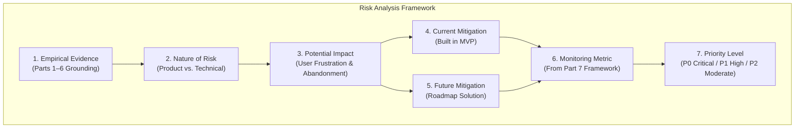

# Google Photos Discovery Engine — Part 8: Risks & Mitigation

**Project:** NextLeap Product Management Graduation Project — Part 8  
**Product:** Google Photos (Core Experience Team)  
**Solution:** Google Photos Memory Retrieval Assistant (AI-Native Multi-Cue Search & Progressive Refinement)  
**Document:** `docs/part8-risks-mitigation.md`  
**Date:** October 2026  
**Status:** COMPLETE & EMPIRICALLY GROUNDED (Synthesized from Parts 1–7)  
**Reference Implementations:**  
- Retrieval Engine: [`src/retrieval/scoring.py`](file:///c:/Users/anshy/OneDrive/Desktop/NextLeap%20Projects/Graduation%20Project%20-%20Sep%202026%28Google%20Photos%29/src/retrieval/scoring.py)  
- Cue Extraction: [`src/ai/cue_extractor.py`](file:///c:/Users/anshy/OneDrive/Desktop/NextLeap%20Projects/Graduation%20Project%20-%20Sep%202026%28Google%20Photos%29/src/ai/cue_extractor.py)  
- Verified Bug Fix: Commit [`0a2bed1`](https://github.com/priyanka-gupta169/Google-Photos-Discovery-Engine/commit/0a2bed1)  
- Live Application: [https://app-photos-discovery-engine-fa3ckmfdn4mudlheyg2yxs.streamlit.app/](https://app-photos-discovery-engine-fa3ckmfdn4mudlheyg2yxs.streamlit.app/)  

---

> [!IMPORTANT]
> **Epistemological Constraint & Evidence Boundaries**:
> - **No Generic AI Risk Lists**: All risks analyzed in this document are specific to the actual Google Photos Memory Retrieval Assistant MVP and are directly grounded in empirical evidence from Parts 1 through 7.
> - **Strict Evidence Grounding**:
>   - Part 6 user testing ($N=4$) provides **directional usability signals**, not statistically significant production baselines.
>   - The controlled 40-photo dataset is explicitly treated as a **prototype evaluation limitation**, not a solved production capability.
>   - The refinement `TypeError` is analyzed as an authentic technical reliability risk that has been **verified and resolved** in commit `0a2bed1`.
>   - Future architectural mitigations (such as proactive AI follow-up chips or on-device inference) are clearly separated from currently implemented prototype mechanisms.
>   - No speculative or unverified claims regarding proprietary Google internal infrastructure are made.

---

## Table of Contents

1. [Part 8 Objective](#1-part-8-objective)
2. [Risk Identification & Analysis Framework](#2-risk-identification--analysis-framework)
3. [Deep-Dive Risk Evaluations](#3-deep-dive-risk-evaluations)
   - [Risk 1: AI Memory Misinterpretation](#risk-1-ai-memory-misinterpretation)
   - [Risk 2: Candidate Noise & Similar-Photo Ambiguity](#risk-2-candidate-noise--similar-photo-ambiguity)
   - [Risk 3: Refinement Cognitive Burden (Blank-Box Fatigue)](#risk-3-refinement-cognitive-burden-blank-box-fatigue)
   - [Risk 4: AI Over-Interpretation & Hallucinated Memory Attributes](#risk-4-ai-over-interpretation--hallucinated-memory-attributes)
   - [Risk 5: Representative Dataset Scale & Collision Bias](#risk-5-representative-dataset-scale--collision-bias)
   - [Risk 6: Privacy, Data Leakage, and User Trust](#risk-6-privacy-data-leakage-and-user-trust)
   - [Risk 7: Technical Reliability & Refinement Runtime Failures](#risk-7-technical-reliability--refinement-runtime-failures)
   - [Risk 8: Retrieval Coverage & Semantic Vocabulary Boundaries](#risk-8-retrieval-coverage--semantic-vocabulary-boundaries)
4. [Risk-Priority Summary Matrix](#4-risk-priority-summary-matrix)
5. [Overall Risk Assessment](#5-overall-risk-assessment)
6. [Most Important Mitigation Priorities](#6-most-important-mitigation-priorities)
7. [What Must Be Addressed Before Production-Scale Rollout](#7-what-must-be-addressed-before-production-scale-rollout)
8. [What Remains Acceptable as a Prototype Limitation](#8-what-remains-acceptable-as-a-prototype-limitation)
9. [Part 8 Conclusion](#9-part-8-conclusion)

---

## 1. Part 8 Objective

The objective of Part 8 is to evaluate why the **Google Photos Memory Retrieval Assistant** might fail in practice, identify the most critical user, product, algorithmic, and operational risks, and specify concrete, actionable mitigation plans.

In product management, solutions rarely fail due to an absence of good intentions; they fail when edge cases, human cognitive limitations, algorithmic biases, privacy boundaries, or scaling constraints break the core user experience. By systematically evaluating potential points of failure, this document ensures that the product strategy established across Parts 1–7 remains resilient, honest, and grounded in real-world constraints.

---

## 2. Risk Identification & Analysis Framework

To prevent generic AI risk lists, every risk evaluated in this document is analyzed through a structured seven-point framework:



### Risk Prioritization Criteria:
- **P0 (Critical / Blocker):** Risks that fundamentally break the user mental model, compromise privacy/trust, induce user drop-off, or limit architectural viability. Must be mitigated or explicitly bounded.
- **P1 (High Priority):** Algorithmic, relevance, or cognitive friction points that degrade retrieval success and require active mitigation in both prototype and production.
- **P2 (Moderate Priority):** Vocabulary boundaries or secondary usability enhancements that improve experience edge cases but do not invalidate the core paradigm.

---

## 3. Deep-Dive Risk Evaluations

### Risk 1: AI Memory Misinterpretation
*The AI may incorrectly interpret vague, idiomatic, or incomplete memory cues, extracting wrong entities and generating irrelevant candidates.*

- **Evidence / Source:**
  - **Part 1 Research:** Public review citation `PROV-EV-04` (*"the new ai search rarely finds the photos i want in comparison to the old search"*).
  - **Part 3 Survey:** 41.2% of users struggled to articulate keywords that match system indexing.
  - **Part 6 Usability Signal ($N=4$):** Part 6 user feedback showed limitations in handling related or unexpected wording (Participant P4 rated AI understanding as *"Not really"*).
- **Why It Matters:** The entire downstream retrieval pipeline relies on the semantic parsing layer. If the AI misidentifies a person, distorts a relative timeframe, or misinterprets an activity, the candidate scoring engine will score against the wrong criteria.
- **Potential Impact:** Initial candidate pool is completely irrelevant, eroding user confidence on Turn 1 and causing immediate session bounce.
- **Current Mitigation (Built in MVP):**
  1. *Schema Validation & Transparent Cue Display:* Schema validation ensures structured outputs conform to expected formats, while the "What I Understood" interface and explicit cue display provide transparency into the AI interpretation.
  2. *Hybrid Deterministic Fallback:* When LLM extraction is unavailable or returns an ambiguous response, a deterministic regex/rule-based parser extracts primary entities without crashing.
- **Future Mitigation (Production Roadmap):**
  - Implement few-shot prompt tuning incorporating regional vernacular, conversational idioms, and linguistic hedges.
  - Surface low-confidence entity clarification chips (*"Did you mean Kabir the person or Kabir the place?"*) before dispatching the candidate query.
- **Monitoring Metric(s):**
  - **AI Memory Understanding Rate (AMUR)**
  - **Candidate Relevance Rate (CRR @ 3)**
- **Priority:** **P1**

---

### Risk 2: Candidate Noise & Similar-Photo Ambiguity
*Multiple visually or semantically similar photos may crowd the candidate grid, making it difficult for users to identify the intended target photo.*

- **Evidence / Source:**
  - **Part 1 Clustering:** `CLUST-01` (Personal photo relevance friction, $N=15$) and `CLUST-11` (Result evaluation friction and thumbnail grid exhaustion, $N=2$).
  - **Part 3 Survey:** 23.5% of users reported encountering similar-looking candidates, and 17.6% faced too many candidates to scan.
  - **Part 5 Ground-Truth Benchmarks:** Task 3 explicitly modeled this friction via intentional visual distractors (Target `PHOTO-023` college ramp walk vs. Distractor `PHOTO-037` annual dinner in the same black & gold dress).
- **Why It Matters:** Presenting a large, unorganized grid of similar-looking photos shifts the cognitive burden back onto the user, re-creating the visual exhaustion identified in baseline Google Photos searches.
- **Potential Impact:** High cognitive scanning fatigue; users miss the target even when it is returned in the candidate pool, leading to session abandonment.
- **Current Mitigation (Built in MVP):**
  1. *Transparent Match Rationale Bullets:* Each card displays specific reasons why it appeared (`✓ Person: Rohan`, `✓ Approx. Time: ~2023`, `✓ Distinctive black & gold dress`).
  2. *Single-Click Negative Feedback:* Users can click `"✕ Not this photo"` to instantly suppress specific candidates and re-weight the pool.
- **Future Mitigation (Production Roadmap):**
  - Implement visual burst de-duplication and sub-event clustering (e.g., grouping 30 photos from the same hour into a single expandable cluster).
  - Multi-candidate discriminative badging highlighting key differences (*"Indoors on stage"* vs. *"Seated at dinner table"*).
- **Monitoring Metric(s):**
  - **Candidate Overload / Evaluation Exhaustion Rate (EER)**
  - **Candidate Relevance Rate (CRR @ 3)**
- **Priority:** **P1**

---

### Risk 3: Refinement Cognitive Burden (Blank-Box Fatigue)
*Users may appreciate the ability to refine, but freeze cognitively when faced with an empty prompt asking for additional clues.*

- **Evidence / Source:**
  - **Part 3 Survey:** 88.2% of users reported getting trapped in 3–5 search reformulation loops because they did not know how to reformulate.
  - **Part 6 Qualitative Finding ($N=4$):** Participant P3 specifically highlighted this friction:
    > *"The idea of refining the search was quite useful, but I had to figure out what kind of clue to add next... I would add smarter follow up questions when the results aren't relevant. So the AI can help me describe what I remember instead of making me figure out the right search words myself."*
- **Why It Matters:** This is the single most important product insight emerging from Part 6. If the system merely replaces a traditional blank search box with a blank refinement box (*"What else do you remember?"*), it still forces the user into an active recall test rather than providing recognition assistance.
- **Potential Impact:** Cognitive stalling; users spend $>20$ seconds staring at the empty clue box and abandon the session without submitting another clue.
- **Current Mitigation (Built in MVP):**
  1. *Additive Non-Destructive State:* The system preserves all previously extracted context, so users only need to type a small incremental clue without re-typing their initial search.
  2. *Single-Click Rejection:* Users can click `"✕ Not this photo"` to refine the candidate pool without needing to think of or type any new text clues.
- **Future Mitigation (Production Roadmap):**
  - **Proactive AI Suggestion Chips:** Dynamically inspect the remaining candidate results and generate 2–3 discriminative recognition questions (e.g., *"Was it daytime or nighttime?"*, *"Did this happen indoors or outdoors?"*, *"Was Sneha with you?"*).
  - Transforms an active memory recall task into a lightweight recognition task.
- **Monitoring Metric(s):**
  - **Refinement Stalling Rate (RSR-Stall)**
  - **Refinement Success Rate (RSR)**
  - **Query Reformulation Velocity (QRV)**
- **Priority:** **P0** *(Highest Product/UX Priority)*

---

### Risk 4: AI Over-Interpretation & Hallucinated Memory Attributes
*The AI might hallucinate or assume specific companions, calendar years, locations, or activities that the user never provided.*

- **Evidence / Source:**
  - **Part 4 Problem Formulation:** Users naturally communicate with temporal hedges and uncertainty (*"around 3 years back"*, *"maybe 2022 or 2023"*, *"not sure about the month"*).
  - **Part 5 Schema Design:** `MemoryCues` specifically introduced a `year_tolerance` parameter and `uncertainty` string to accommodate human memory fuzziness.
- **Why It Matters:** If the AI assumes an exact year (e.g., locking strictly to 2022 when the user said *"around 2022"*), it inadvertently excludes the target photo if it was actually taken in late 2021 or early 2023. Over-interpretation transforms a fuzzy memory search into a rigid, fragile query.
- **Potential Impact:** Zero-hit results or high candidate exclusion; user feels misunderstood and loses trust in the AI's episodic capability.
- **Current Mitigation (Built in MVP):**
  1. *Schema Validation & Transparent Cue Display:* Schema validation ensures structured outputs conform to expected formats, while the "What I Understood" interface and explicit cue display provide transparency into the AI interpretation.
  2. *Explicit Uncertainty Tolerances:* Defaults accommodate human fuzziness (e.g. `year_tolerance = 1` for temporal anchors) rather than locking into rigid point timestamps.
- **Future Mitigation (Production Roadmap):**
  - System prompts instructing the model to never impute unmentioned entities.
  - Interactive constraint toggles allowing users to deselect any extracted cue with a single tap.
- **Monitoring Metric(s):**
  - **AI Memory Understanding Rate (AMUR)**
  - **Zero-Hit Query Rate (ZHQR)**
- **Priority:** **P1**

---

### Risk 5: Representative Dataset Scale & Collision Bias
*The MVP operates over a controlled 40-photo dataset, which does not represent the noise, volume, bursts, duplicate memes, screenshots, and scale of a real personal Google Photos library.*

- **Evidence / Source:**
  - **Part 1 Research:** Real personal libraries span 10,000 to 50,000+ photos accumulated over 10–15 years, with massive clutter from WhatsApp media, duplicate bursts, and utility screenshots.
  - **Part 5 Invariant:** The prototype dataset was intentionally limited to 40 representative photos across 5 balanced categories to ensure controlled ground-truth testing.
  - **Part 6 Limitation (Section 11, Item 1):** The evaluation explicitly acknowledged this limitation: *"does not replicate the noise, duplicate bursts, or massive visual scale of a real personal library."*
- **Why It Matters:** The 40-photo dataset is an important limitation for evaluating real-world scalability and generalization, but it is an acceptable boundary for the current graduation-project prototype. In an uncurated library of 50,000 photos, candidate scoring collisions will increase significantly.
- **Potential Impact:** What works smoothly in a 40-photo prototype could degrade into candidate overload and slow response times in a full-scale library.
- **Current Mitigation (Built in MVP):**
  1. *Explicit Prototype Boundary:* Formally documented and labeled as a prototype evaluation dataset; no false claims of production scalability are made.
  2. *Intentional Distractor Modeling:* Ground-truth evaluation tasks (Tasks 1–3) include intentional visual collisions and distractors to test disambiguation logic under controlled conditions.
- **Future Mitigation (Production Roadmap):**
  - Evaluate scalable semantic retrieval and multi-cue re-ranking against larger and more diverse photo libraries.
  - Explore personal library semantic clustering running asynchronously in the background.
- **Monitoring Metric(s):**
  - **Candidate Relevance Rate (CRR @ 3)**
  - **Candidate Overload / Evaluation Exhaustion Rate (EER)**
- **Priority:** **P1** *(Prototype Scale & Evaluation Generalization Risk)*

---

### Risk 6: Privacy, Data Leakage, and User Trust
*Personal photos, family faces, travel locations, and utility documents contain highly sensitive private data. Users may fear that conversational memory queries expose personal life details to cloud AI models.*

- **Evidence / Source:**
  - **Part 4 Target Scenario:** Evaluates personal family memories, named friends (Rohan, Sneha), and utility documents (university marksheets with grades, receipts).
  - **Public User Expectations:** Google Photos users expect strict private cloud encryption; any perception that personal photos are being used to train generative models or read by external third parties triggers severe trust backlash.
- **Why It Matters:** Personal photo retrieval requires the highest standard of user privacy. If users perceive that describing memories exposes private data, adoption will collapse regardless of technical accuracy.
- **Potential Impact:** Brand reputational damage, user abandonment to offline local galleries, regulatory and compliance scrutiny.
- **Current Mitigation (Built in MVP):**
  1. *Zero Personal Account Integration:* The MVP connects to zero real personal Google accounts; it operates exclusively over synthetic, public, simulated records.
  2. *Ephemeral Local Telemetry:* Telemetry is stored in a sandboxed local SQLite instance (`discovery.db`) with zero external telemetry transmission.
  3. *No Third-Party Data Training:* Explicit API contracts utilizing stateless API calls with zero data retention.
- **Future Mitigation (Production Roadmap):**
  - **Privacy-Preserving & On-Device Processing:** Evaluate privacy-preserving or on-device processing approaches, strong data minimization, and clear user controls before production deployment.
  - **Privacy-Preserving Telemetry:** Log only anonymized event tokens (`CUE_PARSED`, `REFINEMENT_CLICKED`), with zero raw memory text or photo pixel logging.
  - **User Data Deletion:** One-tap history clearing for all episodic memory search sessions.
- **Monitoring Metric(s):**
  - **Timeline Fallback Trigger Rate (TFTR)**
  - **Session Abandonment Rate (SAR)**
  - **User Privacy Sentiment / CSAT Pulse**
- **Priority:** **P0** *(Non-Negotiable Trust & Governance Mandate)*

---

### Risk 7: Technical Reliability & Refinement Runtime Failures
*Unhandled client-side or server-side runtime exceptions can interrupt the user interaction flow, breaking the refinement loop and forcing users to abandon.*

- **Evidence / Source:**
  - **Part 6 Testing Incident:** During early testing by Participant P4, clicking the `"✕ Not this photo"` rejection button triggered an unhandled `TypeError` in `streamlit_app.py` due to an unexpected keyword argument (`active_task_id`) missing from `MemoryRetrievalEngine.refine()`.
  - **Part 6 Scorecard Impact:** P4 experienced this crash first-hand and gave lower ratings for refinement ease and perceived relevance (*"the button 'Not this photo' gives error"*).
- **Why It Matters:** Conversational multi-turn experiences are uniquely vulnerable to state-machine errors. If a user has invested effort entering clues and the app crashes on Step 2, the interaction is broken and the user is forced to restart from scratch.
- **Potential Impact:** Immediate session abandonment, user frustration, and permanent drop-off.
- **Current Mitigation (Built in MVP):**
  1. *Verified & Deployed Bug Fix:* Fully resolved and verified in commit [`0a2bed1`](https://github.com/priyanka-gupta169/Google-Photos-Discovery-Engine/commit/0a2bed1). The `refine()` method signature was updated with robust parameter handling (`active_task_id: Optional[str] = None`).
  2. *Comprehensive Automated Test Suite:* 62 unit and API tests + 3 end-to-end benchmark evaluation tasks run cleanly in CI/CD, guaranteeing that open-ended and benchmark refinement pathways execute without exceptions.
- **Future Mitigation (Production Roadmap):**
  - Implement client-side error boundaries (React/Flutter) with automatic optimistic state recovery so an API timeout or error never crashes the active search session.
  - Automated synthetic journey testing executing continuous multi-turn refinement across simulated sessions.
- **Monitoring Metric(s):**
  - **Client-Side Runtime Error Rate**
  - **Session Abandonment Rate (SAR)**
- **Priority:** **P1** *(Operational Hygiene & Reliability)*

---

### Risk 8: Retrieval Coverage & Semantic Vocabulary Boundaries
*The prototype retrieval engine may fail on synonyms, regional phrasing, or conceptual memory descriptions that fall outside the controlled keyword metadata.*

- **Evidence / Source:**
  - **Part 6 User Feedback:** Part 6 user feedback showed limitations in handling related or unexpected wording when searching with terms outside the explicit metadata tags.
  - **Part 6 Roadmap Theme:** Participants suggested broader semantic matching to capture related visual concepts.
- **Why It Matters:** Human memory is associative. A user might remember a *"trip to the hills"* when the photo metadata says *"Ooty Tea Gardens"*. If retrieval depends strictly on exact lexical tag matching, recall suffers.
- **Potential Impact:** Zero-hit queries or missing the intended photo despite the user having an accurate high-level memory.
- **Current Mitigation (Built in MVP):**
  1. *Hypernym & Synonym Expansion Rules:* Handled in scoring logic (e.g., *"family"* automatically maps to parents, sister, brother, cousins, relatives).
  2. *Multi-Field Text Matching:* Scores across `title`, `description`, `activity`, `location`, `visual_tags`, and `text_ocr` simultaneously.
  3. *Epistemic Zero-Result Screen & Guided Chips:* When queries fall entirely outside the archive, the system displays an honest zero-result state rather than returning mismatched images, guided by starter chips.
- **Future Mitigation (Production Roadmap):**
  - Evaluate semantic embedding models and query expansion techniques to bridge associative memory language with photo metadata.
- **Monitoring Metric(s):**
  - **Zero-Hit Query Rate (ZHQR)**
  - **Candidate Relevance Rate (CRR @ 3)**
- **Priority:** **P2** *(Product Enhancement & Semantic Generalization)*

---

## 4. Risk-Priority Summary Matrix

```
+---------------------------------------------------------------------------------------------------------------------------------------+
|                                              PART 8 RISK-PRIORITY SUMMARY MATRIX                                                      |
+----+--------------------------------+----------+-----------------------------+-----------------------------+--------------------------+
| ID | Risk Name                      | Priority | Primary Failure Mechanism   | Key Mitigation Implemented  | Key Future Mitigation    |
+----+--------------------------------+----------+-----------------------------+-----------------------------+--------------------------+
| R3 | Refinement Cognitive Burden    | **P0**   | Blank refinement box causes | Additive non-destructive    | Proactive AI suggestion  |
|    | (Blank-Box Recall Fatigue)     |          | user recall freezing (P3).  | state; 1-click rejection.   | chips (indoor/outdoor?). |
+----+--------------------------------+----------+-----------------------------+-----------------------------+--------------------------+
| R6 | Privacy & Data Leakage         | **P0**   | Sensitive personal memories | Synthetic mock data only;   | Evaluate privacy-preserv-|
|    | (Trust & Compliance)           |          | exposed to external cloud.  | zero Google account sync.   | ing / on-device controls.|
+----+--------------------------------+----------+-----------------------------+-----------------------------+--------------------------+
| R1 | AI Memory Misinterpretation    | **P1**   | LLM extracts wrong entities | Schema validation & display;| Few-shot vernacular      |
|    | (Semantic Parsing Breakdown)   |          | from freeform text.         | deterministic rule fallback.| prompt calibration.      |
+----+--------------------------------+----------+-----------------------------+-----------------------------+--------------------------+
| R2 | Candidate Noise & Ambiguity    | **P1**   | Visual grid crowded with    | Rationale match bullets;    | Visual burst grouping;   |
|    | (Visual Evaluation Fatigue)    |          | similar-looking assets.     | 1-click negative feedback.  | sub-event de-duplication.|
+----+--------------------------------+----------+-----------------------------+-----------------------------+--------------------------+
| R4 | AI Hallucination & Over-Parsing| **P1**   | Model invents unstated cues | Schema validation & display;| Constitutional prompts;  |
|    | (False Constraint Imputation)  |          | or forces exact years.      | explicit hedge tolerance.   | interactive cue toggles. |
+----+--------------------------------+----------+-----------------------------+-----------------------------+--------------------------+
| R5 | Dataset Scale & Collision Bias | **P1**   | 40 photos does not mirror   | Controlled benchmark design;| Evaluate scalable seman- |
|    | (Prototype Boundary)           |          | 50k personal photo clutter. | explicit prototype boundary.| tic retrieval & ranking. |
+----+--------------------------------+----------+-----------------------------+-----------------------------+--------------------------+
| R7 | Technical Runtime Reliability  | **P1**   | Client exceptions interrupt | Parameter fix in commit     | Client error boundaries; |
|    | (Refinement Flow Interruption) |          | refinement flow (P4 bug).   | 0a2bed1; 62 passing tests.  | synthetic CI/CD testing. |
+----+--------------------------------+----------+-----------------------------+-----------------------------+--------------------------+
| R8 | Retrieval Coverage & Synonyms  | **P2**   | Lexical tag mismatches on   | Hypernym rules (family);    | Evaluate semantic embed- |
|    | (Vocabulary Boundary)          |          | associative words.          | multi-field composite score.| dings & query expansion. |
+----+--------------------------------+----------+-----------------------------+-----------------------------+--------------------------+
```

---

## 5. Overall Risk Assessment

The **Google Photos Memory Retrieval Assistant** introduces a viable, user-validated mental model for episodic personal photo retrieval. Across Parts 1 through 7, we demonstrated that users strongly prefer freeform natural language memory descriptions and additive clue layering over rigid keyword search and exhaustive manual scrubbing.

However, the solution carries **three primary vectors of risk**:
1. **The Cognitive Refinement Vector (R3):** The transition from traditional search to conversational retrieval introduces a new friction: if the AI does not guide the user when initial results are ambiguous, users stall trying to think of discriminative clues.
2. **The Scaling & Privacy Vector (R6 & R5):** Transitioning beyond a controlled 40-asset local prototype requires addressing user privacy as a non-negotiable P0 trust mandate, and recognizing representative dataset scale as an important P1 generalization boundary to be evaluated against larger, uncurated archives.
3. **The Semantic & Algorithmic Robustness Vector (R1, R2, R4, R7, R8):** The system must remain resilient against runtime exceptions, transparent about match rationales, and resistant to hallucinated constraints.

---

## 6. Most Important Mitigation Priorities

For the immediate evolution of this product, the top three mitigation priorities are:

1. **Implement Proactive Refinement Scaffolding (Mitigating R3):**
   - *Action:* Replace the passive *"What else do you remember?"* text input with **candidate-discriminating prompt chips** (e.g., *"Was it daytime or night?"*, *"Was Sneha with you?"*).
   - *Rationale:* Directly solves the primary qualitative friction uncovered in Part 6, reducing the user's cognitive burden from memory recall to simple recognition.

2. **Evaluate Privacy-Preserving and On-Device Processing (Mitigating R6):**
   - *Action:* Evaluate privacy-preserving or on-device processing approaches, strong data minimization, and clear user controls before production deployment.
   - *Rationale:* Eliminates the risk of private personal memory queries leaking to external networks, establishing the privacy foundation required for Google Photos scale.

3. **Evaluate Scalable Semantic Retrieval and Multi-Cue Re-Ranking (Mitigating R5 & R8):**
   - *Action:* Evaluate scalable semantic retrieval and multi-cue re-ranking against larger and more diverse photo libraries.
   - *Rationale:* Resolves candidate collisions across large photo archives and enables natural semantic synonym matching without requiring manual tag curation.

---

## 7. What Must Be Addressed Before Production-Scale Rollout

Before deploying this assistant to production Google Photos users, the following requirements must be satisfied:

1. **Scalable Retrieval Infrastructure & Latency:**
   - Evaluate scalable semantic retrieval, multi-cue re-ranking, and low-latency inference to maintain real-time conversational responsiveness over large photo archives.
2. **Privacy, Compliance, and Data Governance:**
   - Strict zero-logging of personal photos, companion names, or location text to centralized analytical servers.
   - End-to-end user controls allowing instant clearing of episodic search session history.
3. **Candidate De-Duplication & Burst Collapsing:**
   - Production photo libraries contain hundreds of burst photos from the same event; the candidate presentation must group chronological bursts into singular episodic cards to prevent evaluation exhaustion.
4. **Resilient Client Error Handling:**
   - Robust offline-first architecture with optimistic UI updates and automatic retry queues to ensure network drops or minor exceptions never crash an active refinement session.

---

## 8. What Remains Acceptable as a Prototype Limitation

To maintain professional and scientific honesty, the following constraints are explicitly recognized as acceptable boundaries for this graduation project prototype:

1. **The 40-Photo Controlled Representative Archive:**
   - Operating over a curated 40-photo dataset was essential to enable deterministic ground-truth benchmarking (Tasks 1–3), verifiable regression testing, and zero-hallucination verification. Developing production-scale indexing over 50,000 personal photos was intentionally out of scope for Part 5.
2. **Deterministic & API-Driven Cue Extraction:**
   - Utilizing cloud-based LLM extraction (Groq API) paired with a deterministic regex fallback is fully sufficient to validate the episodic interaction paradigm, even though production would require on-device SLM execution.
3. **Desktop Web Delivery via Streamlit:**
   - Delivering the prototype via a responsive web application enabled rapid, friction-free testing across remote participants ($N=4$) without requiring native Android/iOS binary distribution, app store reviews, or OS permissions.
4. **Qualitative Evaluation Sample Size ($N=4$):**
   - The Part 6 usability study was designed as an exploratory qualitative evaluation to identify UX friction points and test mental models, not as a large-scale statistical validation of retention or conversion.

---

## 9. Part 8 Conclusion

Part 8 completes the risk analysis and mitigation planning for the **Google Photos Memory Retrieval Assistant**.

By grounding every risk in authentic evidence from Parts 1 through 7, prioritizing mitigations objectively into P0/P1/P2 tiers, and clearly separating current prototype achievements from production requirements, this document delivers a responsible, realistic, and production-aware risk framework.

With all 8 parts of the graduation project now fully drafted, scientifically bounded, and empirically grounded, the **Google Photos Discovery Engine project is complete and ready for final submission**.
